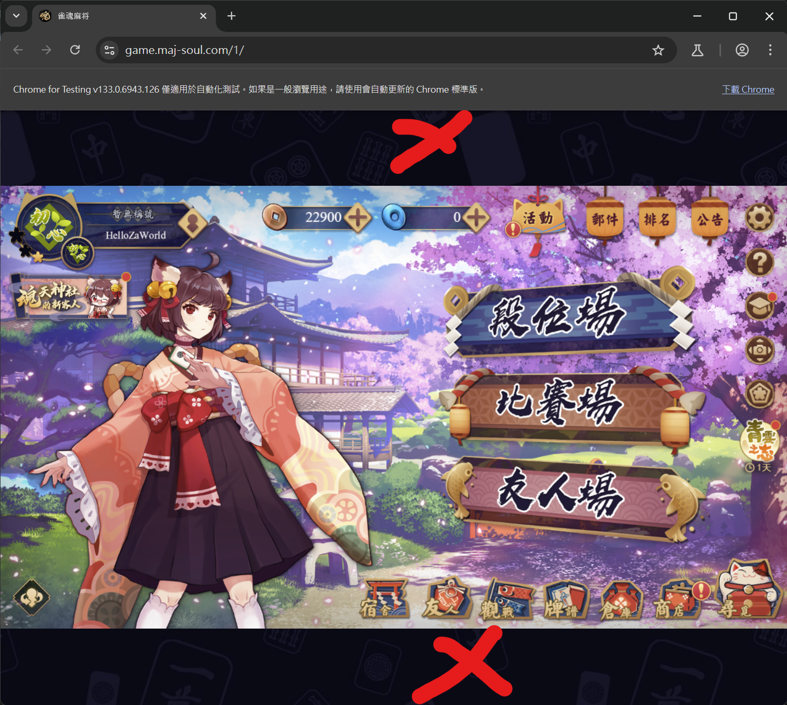

<br/>
<p align="center">
  
  <h1 align="center">Akagi</h3>

  <p align="center">
「死ねば助かるのに………」- 赤木しげる<br>
<br>
    <br/>
    <br/>
    <a href="https://discord.gg/Z2wjXUK8bN">Ask me anything about this at Discord</a>
    <br/>
    <br/>
    <a href="./README_ZH.md">中文</a>
    <br/>
    <a href="https://github.com/shinkuan/Akagi/issues">Report Bug</a>
    .
    <a href="https://github.com/shinkuan/Akagi/issues">Request Feature</a>
  </p>
</p>

<p align="center">
  <a href="https://github.com/shinkuan/Akagi"></a>
  <a href="https://github.com/shinkuan/Akagi/releases"></a>
  <a href="https://github.com/shinkuan/Akagi/issues"></a>
  <a href="https://github.com/shinkuan/Akagi"></a>
  <a href="https://discord.gg/Z2wjXUK8bN"></a>
  <a href="https://deepwiki.com/shinkuan/Akagi"></a>
</p>

# About

## "The purpose of this project is to provide people with a convenient way to real-time understand their performance in Mahjong game matches and to learn and improve from it. This project is intended for educational purposes only, and the author is not responsible for any actions taken by users using this project. Game developers and publishers have the right to take action against users who violate their terms of service, any consequences such as account suspension are not related to the author."


# Feature
- Real-time analysis of your game.
- Support for multiple platforms.
  - Majsoul
  - Tenhou
  - RiichiCity
  - Amatsuki
- Support for multiple game modes.
  - Four Player
  - Three Player
- Support for multiple AI models.
  - Builtin model
  - Online server model
  - Your own model
- AutoPlay
  - *Only available on Windows Release version when ot_server is running.
- TUI
  - Using Textual UI.
  - Support for multiple themes.

# Table of Contents

### ⚠️ READ THE DOC BEFORE YOU START
### ⚠️ READ THE DOC BEFORE YOU START
### ⚠️ READ THE DOC BEFORE YOU START

- [About](#about)
- [Before You Start](#before-you-start)
- [Installation](#installation)
- [Usage](#usage)
- [Troubleshooting](#troubleshooting)
- [Developer](#developer)
- [LICENSE](#license)
  
# Before You Start

🎥[YouTube Video for you to follow.](https://youtu.be/Z88Ncxbe2nw)

### You will need:

1. A `mjai_bot`. 
   1. A working one is already included [here](./mjai_bot/mortal).
      - Because the limit of the file size, the `mortal.pth` here is a tiny weak small model.
      - It is not recommended to use it in a real game.
      - You can get a better model from [Discord](https://discord.gg/Z2wjXUK8bN).
      - Or use the hosted model from the online server.
      - You can get the API key from [Discord](https://discord.gg/Z2wjXUK8bN).
   2. Or make your own one, check [Developer setcion](#developer).
2. Use Windows Terminal to open akagi for a nice looking TUI.
3. Proxifier or similar tools to redirect game client to the MITM port.

> [!TIP]
> Some people have wrote a __keygen__ for __Proxifier__, you can find it using __Google__.
> 
> Authors of this project are not responsible for any illegal actions taken by users.

> [!WARNING]  
> __Windows Terminal__ is required for user interface to work properly.
> Defalt Windows console will make the UI look ugly and not usable.

### Supported Mahjong Games:

| Platform       | Four Player   | Three Player   | AutoPlay |
| -------------- | ------------- | -------------- | -------- |
| __Majsoul__    | &check;       | &check;        | *&check; |
| __Tenhou__     | &check;       | &check;        |  &cross; |
| __RiichiCity__ | &check;       | &check;        |  &cross; |
| __Amatsuki__   | &check;       | &check;        |  &cross; |

*AutoPlay only avaliable on [Windows Release version](https://github.com/shinkuan/Akagi/releases) when ot_server is running.

# Installation

- For User:
  - Go to [release page](https://github.com/shinkuan/Akagi/releases)
  - Download the latest release.
  - Extract the zip file.
  - Put MJAI bots in `./Akagi/mjai_bot`.
  - Run `run_akagi.exe`
- For Developer:
  - Clone the repository.
  - Use Python 3.12
  - Install the dependencies using `pip install -r requirements.txt`.
  - Put MJAI bots in `./Akagi/mjai_bot`.
    - For the builtin model, move `./mjai_bot/mortal/libriichi/libriichi-<version>-<platform>.<extension>` to `./mjai_bot/mortal/libriichi.<extension>`.
    - Same for 3p model.
  - Run `run_akagi.py`.

# Usage

1. **Check your settings and AI Model.**
   1. Select a Model.
      - By clicking on the "Model" button in the bottom left corner.
      - Select a model from the list.
      - If you don't have a model, get it from [Discord](https://discord.gg/Z2wjXUK8bN).
      - Builtin default model is weak AI.
      - __Choose 3P model for 3P game!__
      - __Do not join 3P game with 4P model!__
   2. Check your settings.
      - By clicking on the "Settings" button in the bottom left corner.
      - Check your settings and make sure they are correct.
      - Set the MITM type to the game you are playing.
      - Set the MITM host and port to the correct values.
      - If you don't know what to set, leave it as default.
      - Default: (host: 127.0.0.1) (port: 7880)
      - If you have got a Online server API key, set it in the settings.
      - Online server provides a stronger AI model.
      - You can get the API key from [Discord](https://discord.gg/Z2wjXUK8bN).
   3. Save your settings.
      - By clicking on the "Save" button.
      - This will save your settings.
   4. Restart Akagi.
      - Close Akagi and open it again.
      - This will apply the settings.
   5. Start MITM.
      - By clicking on the "MITM Stopped" button in the bottom left corner.
      - This will start the MITM proxy server.
2. **Install MITM Proxy Certificate.**
   1. Open File Explorer (press `Windows key + E`)
   2. In the address bar at the top, type: `%USERPROFILE%\.mitmproxy` and press Enter.
   3. Look for a file called `mitmproxy-ca-cert.cer`.
   4. Double-click on the `mitmproxy-ca-cert.cer` file.
   5. Click the "__Install Certificate__" button.
   6. If you see a choice, select "__Local Machine__" and click "Next".
   7. Choose "__Place all certificates in the following store__", then click "__Browse...__"
   8. Select "__Trusted Root Certification Authorities__", click OK, then click "Next" and "Finish".
   9. If you're asked for permission, click "Yes".
3. **Proxifier Setup**
   1. Open Proxifier and go to "Profile" > "Proxy Servers..."
   2. Click "Add..." and enter the following:
      - Address: The host you set in Akagi settings (default: `127.0.0.1`)
      - Port: The port you set in Akagi settings (default: `7880`)
      - Protocol: HTTPS
   3. Click "OK" to save the proxy settings.
   4. Go to "Profile" > "Proxification Rules..."
   5. Add a new rule by clicking "Add..."
   6. In the "Applications" tab, click "Browse..." and select the game executable.
      - This is usually located in the game installation folder.
      - For example, for Mahjong Soul Steam version:
        - Browse to your game in Steam library.
        - Click the manage button (gear icon) and select "Browse local files..."
        - This will open the game installation folder.
        - You should see the game executable file (e.g., `Jantama_MahjongSoul.exe`).
      - For web version, you can use the browser executable (e.g., `chrome.exe` or `firefox.exe`).
   7. In the "Target Hosts" tab, you can leave it default.
   8. In the "Action" tab, select the proxy server you just added.
   9. Click "OK" to save the rule.
4. **Start the game client.**
   - Launch the game client (e.g., Mahjong Soul) and log in.
5. **Join a game.**
   - Join a game as you normally would.
6. **Check Akagi.**
   - You should see the AI analyzing the game in real-time.
   - If you see any errors, check the Logs for more information.
   - Or ask for help in the [Discord](https://discord.gg/Z2wjXUK8bN) server.

## Instructions

### Akagi

#### Starting MITM Proxy Server:


#### Selecting AI Model:
Models are stored in `./mjai_bot/` folder.


#### Changing Settings:
> [!IMPORTANT]  
> Restart might be required to apply the settings.


#### Opening Logs:
When you encounter a problem, you can open the logs to see what happened.
Report the issue with the logs.

logs are saved in `./logs/` folder.


#### Changing MJAI Info Window:
Click on the MJAI Info window to change kind of info you want to see.


#### AutoPlay:
> [!NOTE]
> AutoPlay is only available on Windows Release version when ot_server is running.

Make sure you have set the display of the game client to 16:9 aspect ratio.




#### Changing theme:


#### Call Reach
The recommandation window does not show which tile to discard for riichi?
You have to click on the "Reach" button to show the call reach recommendation.


### Proxifier

> [!NOTE]  
> [Proxifier](https://www.proxifier.com/) is a tool that allows you to redirect network traffic through a proxy server. You can use it to redirect the game client traffic to the MITM proxy server.

#### Example Proxifier proxy settings:


#### Example Proxifier proxy rules:


# Troubleshooting

You can ask for help in the [Discord](https://discord.gg/Z2wjXUK8bN) server.

> [!TIP]
> If you encounter any issues, please check the logs in `./logs/` folder.
> The logs are saved in the `./logs/` folder.
> You can also check the GitHub Issues

> [!NOTE]
> If you find a bug, please report it in the GitHub Issues.
> You can also report it in the Discord server.
> If you have a feature request, please report it in the GitHub Issues.

- MITM Proxy server not working?
  - Make sure you have installed the MITM proxy certificate.
  - Make sure you have set the correct host and port in the settings.
  - Make sure you have set the correct proxy settings in Proxifier.
  - Make sure you have started the MITM proxy server.
  - If above does not work, please [check this issue](https://github.com/shinkuan/Akagi/issues/57).

# Developer

## File Structure

- `./Akagi/` - The main folder of the project.
  - `akagi/` - Contains the Textual UI for Akagi.
  - `logs/` - Contains the logs of the game.
  - `mitm/` - Contains the MITM proxy server.
    - `bridge/` - Contains the bridge between the game client and the server. This is for converting the game client protocol to MJAI protocol. You can make your own bridge here.
      - `majsoul/` - Contains the bridge for Majsoul.
      - `tenhou/` - Contains the bridge for Tenhou.
      - `amatsuki/` - Contains the bridge for Amatsuki.
  - `mjai_bot/` - Contains the MJAI bots.
    - `base/` - Base class for MJAI bots. Check it out if you want to make your own bot.
    - `*/` - MJAI bots. This is your mjai_bot. For example, `mortal/`.
  - `settings/` - Contains the settings of the project.
  - `run_akagi.py` - The main file to run the project.

## Bridge

To make a bridge, you need to implement two things:

1. `ClientWebSocketABC` in `mitm/bridge/mitm_abc.py`.
2. `Bridge` in `mitm/bridge/bridge_base.py`.

For `ClientWebSocketABC`, this is an mitmproxy addon, main goal is to convert the game client protocol to MJAI protocol, and push it in to `mjai_messages: queue.Queue[dict] = queue.Queue()`.
You can check the `mitm/majsoul/` for the example.

For `Bridge`, this is the main class for the bridge. You need to implement the `parse()` method to parse the byte content from the game client into `None | list[dict]`, you can check the `mitm/bridge/amatsuki/bridge.py` for the example.

## MJAI Bot

To make a MJAI bot, you need to implement the `Bot` class in `mjai_bot/base/bot.py`.

TODO: make an tsumogiri bot example.

## TODO

- [x] Three Player Mahjong support.
- [x] RiichiCity support.
- [x] Show which tile to discard after call for riichi.
- [ ] Show which tile to Kan after call for Kan (rare case).

# Contact

- [Shinkuan](https://github.com/shinkuan/) - shinkuan318@gmail.com
- [Discord](https://discord.gg/Z2wjXUK8bN)

# LICENSE

```
“Commons Clause” License Condition v1.0

The Software is provided to you by the Licensor under the License, as defined below, subject to the following condition.

Without limiting other conditions in the License, the grant of rights under the License will not include, and the License does not grant to you, the right to Sell the Software.

For purposes of the foregoing, “Sell” means practicing any or all of the rights granted to you under the License to provide to third parties, for a fee or other consideration (including without limitation fees for hosting or consulting/ support services related to the Software), a product or service whose value derives, entirely or substantially, from the functionality of the Software. Any license notice or attribution required by the License must also include this Commons Clause License Condition notice.

Software: Akagi

License: GNU Affero General Public License version 3 with Commons Clause

Licensor: shinkuan
```
