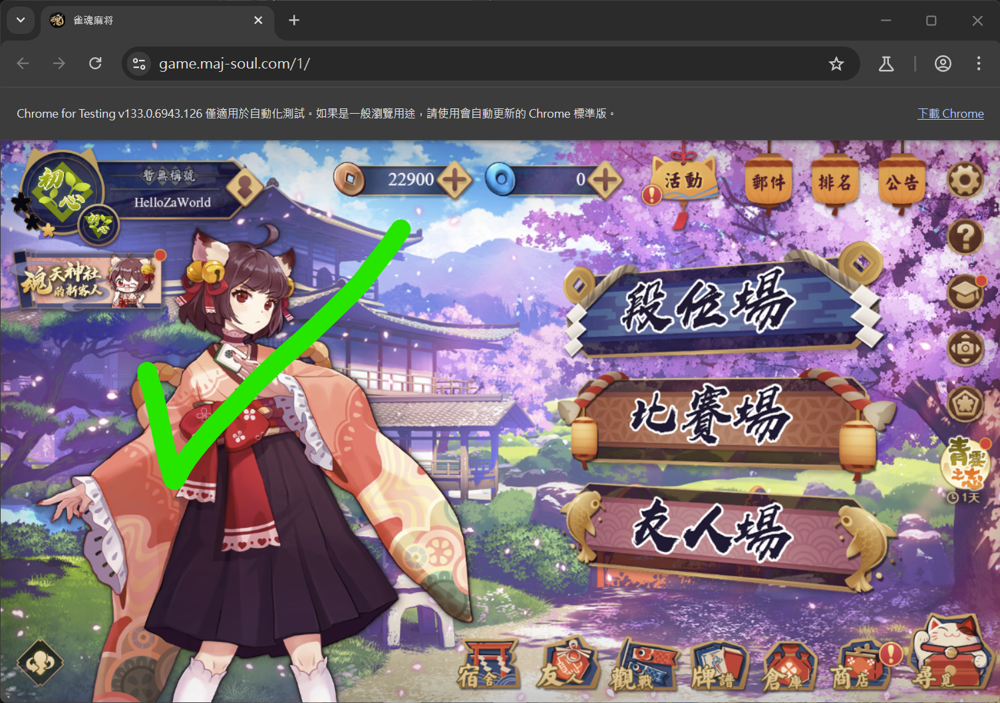
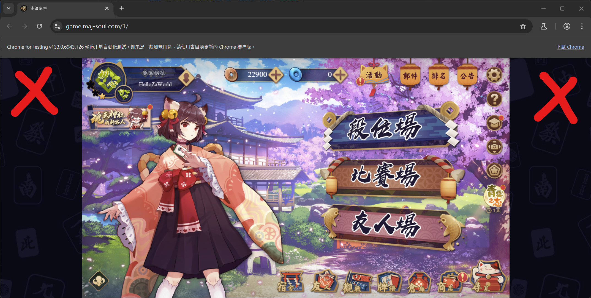

<div align="center">
  
  <h1 align="center">Akagi</h1>

  <div align="center">
  「死ねば助かるのに………」- 赤木しげる<br>
  <div align="center">
  <a href="./README_ZH.md">简体中文</a> | <a href="./README_TW.md">繁體中文</a>
  <br/>
  <a href="https://github.com/shinkuan/Akagi/issues">Report Bug</a> | <a href="https://github.com/shinkuan/Akagi/issues">Request Feature</a> | 
  <a href="https://discord.gg/Z2wjXUK8bN">Questions? Ask in Discord</a>
  <br/>
  <br/>
  </div>
  </div>
</div>

<div align="center">
  <a href="https://github.com/shinkuan/Akagi"></a>
  <a href="https://github.com/shinkuan/Akagi/releases"></a>
  <a href="https://github.com/shinkuan/Akagi/issues"></a>
  <a href="https://github.com/shinkuan/Akagi"></a>
  <a href="https://discord.gg/Z2wjXUK8bN"></a>
  <a href="https://deepwiki.com/shinkuan/Akagi"></a>
</div>

## About

> [!CAUTION]
>
> This project provides a convenient way to view your Mahjong performance in real time so you can learn and improve. It is for educational purposes only. The author is not responsible for any actions taken by users. Game developers and publishers may enforce their Terms of Service, including account suspensions; such consequences are unrelated to the author.


## Features

-   Real-time game information
-   Real-time AI evaluation
-   Supports Majsoul, Tenhou, RiichiCity, and Amatsuki
-   Supports four-player and three-player mahjong
-   Multiple AI model options
    -   Built-in model
    -   Online server model
    -   Custom model
-   AutoPlay (Windows Release only when the online server model is enabled)
-   Textual UI with multiple themes

## Table of Contents

> [!WARNING]
>
> Please read carefully before using

-   [About](#about)
-   [Features](#features)
-   [Before You Start](#before-you-start)
    -   [Prerequisites](#prerequisites)
    -   [Support Matrix](#support-matrix)
-   [Installation](#installation)
    -   [Regular Users](#regular-users)
    -   [Developers](#developers)

## Before You Start

[🎥 Tutorial Video](https://youtu.be/Z88Ncxbe2nw)

### Prerequisites

To use this project, prepare the following:

1. An `mjai_bot`
    1. A working `mortal` mjai bot is already included [here](./mjai_bot/mortal)
        - The `mortal.pth` in `./mjai_bot/mortal` is downsized due to repository limits
        - Not recommended for real matches
        - For other models, join [Discord](https://discord.gg/Z2wjXUK8bN); a Mortal V4 model (~100MB, roughly Majsoul Jade rank) is available there, but you may need to tweak its code to fit this framework
        - For stronger AI, use an online-server model (`ot_server`). Request an API key in [Discord](https://discord.gg/Z2wjXUK8bN); its strength is around Majsoul Celestial
    2. Or build your own model—see [Developers](#developers)
2. Launch Akagi via Windows Terminal (Windows) or Terminal (macOS) to enjoy the Textual UI. You can also disable TUI in the settings and enable DataServer for a front-end/back-end split, using [AkagiFrontend](https://github.com/zhuozhiyongde/AkagiFrontend) to display game info. This lets you view tips via PiP on iOS / iPadOS or other mobile devices; see [Usage](#usage) below for deployment details.
3. Use a proxy tool such as [Clash Party](https://github.com/mihomo-party-org/clash-party) / [Clash Verge Rev](https://github.com/clash-verge-rev/clash-verge-rev) / [Surge](https://nssurge.com/) to route game traffic to the MitM port. See [Usage](#usage) for rule examples.

### Support Matrix

Current platform support:

| Platform       | Four Player | Three Player | AutoPlay  |
| -------------- | ----------- | ------------ | --------- |
| **Majsoul**    | &check;     | &check;      | \*&check; |
| **Tenhou**     | &check;     | &check;      | &cross;   |
| **RiichiCity** | &check;     | &check;      | \*&check; |
| **Amatsuki**   | &check;     | &check;      | \*&check; |

Note: AutoPlay works only in the [Windows Release](https://github.com/shinkuan/Akagi/releases) and requires `ot_server` to be enabled.

## Installation

### Regular Users

On Windows, download the latest build from the [release page](https://github.com/shinkuan/Akagi/releases), extract it, place your mjai bot in `./Akagi/mjai_bot`, then run `run_akagi.exe`.

### Developers

For developers (or macOS/Linux users), clone the repo, install dependencies with Python 3.12, place your mjai bot in `./Akagi/mjai_bot`, choose the correct libriichi library for your platform, then run `run_akagi.py`.

```bash
git clone https://github.com/shinkuan/Akagi.git
cd Akagi
pip install -r requirements.txt
# For users in mainland China you may speed up installs with the Tsinghua mirror:
# pip install -i https://pypi.tuna.tsinghua.edu.cn/simple -r requirements.txt
mv ./mjai_bot/mortal/libriichi/libriichi-<version>-<platform>.<extension> ./mjai_bot/mortal/libriichi.<extension>
python run_akagi.py
```

Choosing the libriichi binary:

-   macOS:
    -   Apple Silicon: `libriichi-*-aarch64-apple-darwin.so`
    -   Intel: `libriichi-*-x86_64-apple-darwin.so`
-   Windows: `libriichi-*-x86_64-pc-windows-msvc.pyd`
-   Linux: `libriichi-*-x86_64-unknown-linux-gnu.so`

Choose `*` based on your Python version. Builds are provided for Python 3.10/3.11/3.12, but Python 3.12 is recommended. If you hit issues on another version, try Python 3.12.

For more details or source code, see the [Mortal](https://github.com/Equim-chan/Mortal) project.

## Usage

There are several steps to get Akagi working—please read carefully.

### Check Settings and AI Model

1. Choose a model
    - Click the `Model` button at bottom-left
    - Pick a model from the list
    - If you have none, get one from [Discord](https://discord.gg/Z2wjXUK8bN)
    - The built-in default model is a weak AI
    - **Use a 3P model for 3-player games**
    - **Do not use a 4P model in 3-player games**
2. Verify settings
    - Click the `Settings` button at bottom-left
    - Confirm your settings are correct
    - Set the MitM type to the game you are playing
    - Set the correct MitM host and port
    - If unsure, keep the defaults
    - Defaults: `host: 127.0.0.1, port: 7880`
    - If you have an online-server API key (stronger models, around Majsoul Celestial), enter it here; request one from [Discord](https://discord.gg/Z2wjXUK8bN) if needed
3. Save settings
    - Click `Save`
    - Persist your changes
4. Restart Akagi
    - Close Akagi and reopen it
    - Settings apply only after restart
5. Start MitM
    - Click the `MitM Stopped` button at bottom-left
    - This starts the MitM proxy server

### Install and Trust the MitM Proxy Certificate

#### Windows

1. Open File Explorer (`Windows key + E`)
2. In the address bar, enter `%USERPROFILE%\.mitmproxy` (default mitmproxy certificate path) and press Enter
3. Locate `mitmproxy-ca-cert.cer`
4. Double-click the certificate
5. Click `Install Certificate`
6. If prompted, choose `Local Machine`, then Next
7. Choose `Place all certificates in the following store`, click `Browse...`
8. Select `Trusted Root Certification Authorities`, confirm, then Next and Finish
9. Approve the elevation prompt if shown

#### macOS

1. Open Finder
2. Press `Command + Shift + G`, enter `~/.mitmproxy`, and press Enter
3. Find `mitmproxy-ca-cert.cer`
4. Double-click to open in Keychain Access
5. Select `System` under System Keychains on the left, search `mitmproxy` in the top-right; you should see the imported certificate marked as untrusted
6. Right-click the `mitmproxy` certificate, choose `Get Info`, expand `Trust`
7. Set `When using this certificate` to `Always Trust`
8. Close the window and authenticate when prompted

#### iOS / iPadOS

If you deploy Akagi as a proxy node via the split front-end/back-end mode, you can use it on iOS / iPadOS, but you must still trust the certificate on that device.

1. Send `mitmproxy-ca-cert.cer` from your computer to the device (AirDrop is easiest and auto-imports; otherwise save to Files and tap the file)
2. Go to `Settings > Profile Downloaded` and install it
3. Go to `General > About > Certificate Trust Settings` and enable the mitmproxy certificate

#### Android

No test environment—please search for device-specific steps.

### Proxy Rules

Akagi starts an HTTPS proxy on `127.0.0.1:7880` (mitmproxy). Use a rule-based proxy app (e.g., `Clash Party`, `Clash Verge`, or `Surge`) to route Majsoul traffic to this port, and bypass the Python process to avoid loopback.

> [!NOTE]
>
> To chain with [MajsoulMax](https://github.com/Avenshy/MajsoulMax) or [MajsoulMax-rs](https://github.com/Xerxes-2/MajsoulMax-rs), build a composite proxy chain—see Advanced Usage below.

With a local node `Akagi` (HTTPS 127.0.0.1:7880), bypass Python processes and send game/web traffic to that node to form a `Game <-> Akagi <-> Server` chain.

#### Clash Party / Clash Verge Example

```yml
proxies:
    - name: Akagi
      type: http
      server: 127.0.0.1
      port: 7880
      tls: true

proxy-groups:
    - name: 🀄 雀魂麻将
      type: select
      proxies:
          - Akagi
          - DIRECT

rules:
    # Avoid loopback
    - AND, ((PROCESS-NAME-REGEX, python.*?), (OR, ((DOMAIN-KEYWORD, majsoul), (DOMAIN-KEYWORD, maj-soul), (DOMAIN-KEYWORD, mahjongsoul), (DOMAIN-KEYWORD, catmjstudio)))), DIRECT
    # Client / Steam
    - PROCESS-NAME,Jantama_MahjongSoul.exe,🀄 雀魂麻将
    - PROCESS-NAME,jantama_mahjongsoul.exe,🀄 雀魂麻将
    - PROCESS-NAME,雀魂麻將,🀄 雀魂麻将
    # Web
    - DOMAIN-KEYWORD,majsoul,🀄 雀魂麻将
    - DOMAIN-KEYWORD,maj-soul,🀄 雀魂麻将
    - DOMAIN-KEYWORD,mahjongsoul,🀄 雀魂麻将
    - DOMAIN-KEYWORD,catmjstudio,🀄 雀魂麻将
```

#### Surge Example

```text
[Proxy]
Akagi = https, 127.0.0.1, 7880

[Proxy Group]
🀄 雀魂麻将 = select, Akagi, DIRECT

[Rule]
# Avoid loopback
AND, ((PROCESS-NAME, python*), (OR, ((DOMAIN-KEYWORD, majsoul), (DOMAIN-KEYWORD, maj-soul), (DOMAIN-KEYWORD, mahjongsoul), (DOMAIN-KEYWORD, catmjstudio)))), DIRECT
# Client / Steam
PROCESS-NAME,雀魂麻將,🀄 雀魂麻将
# Web
DOMAIN-KEYWORD,majsoul,🀄 雀魂麻将
DOMAIN-KEYWORD,maj-soul,🀄 雀魂麻将
DOMAIN-KEYWORD,mahjongsoul,🀄 雀魂麻将
DOMAIN-KEYWORD,catmjstudio,🀄 雀魂麻将
```

#### Clash Verge Global Script (JS) Example

See the [official docs](https://www.clashverge.dev/guide/script.html). In the “Subscriptions” page, right-click `Global Script` and choose “Edit file”:

```js
function main(config) {
    config.proxies.push({
        name: 'Akagi',
        type: 'http',
        server: '127.0.0.1',
        port: 7880,
        tls: true,
    });

    config['proxy-groups'].push({
        name: '🀄 雀魂麻将',
        type: 'select',
        proxies: ['DIRECT', 'Akagi'],
        icon: 'https://www.maj-soul.com/homepage/img/logotaiwan.png',
    });

    const bypass = [
        'AND, ((PROCESS-NAME-REGEX, python.*?), (OR, ((DOMAIN-KEYWORD, majsoul), (DOMAIN-KEYWORD, maj-soul), (DOMAIN-KEYWORD, mahjongsoul), (DOMAIN-KEYWORD, catmjstudio)))), DIRECT',
    ];

    const clientRules = [
        'PROCESS-NAME,Jantama_MahjongSoul.exe,🀄 雀魂麻将',
        'PROCESS-NAME,jantama_mahjongsoul.exe,🀄 雀魂麻将',
        'PROCESS-NAME,雀魂麻將,🀄 雀魂麻将',
    ];

    const webRules = [
        'DOMAIN-KEYWORD,majsoul,🀄 雀魂麻将',
        'DOMAIN-KEYWORD,maj-soul,🀄 雀魂麻将',
        'DOMAIN-KEYWORD,mahjongsoul,🀄 雀魂麻将',
        'DOMAIN-KEYWORD,catmjstudio,🀄 雀魂麻将',
    ];

    config.rules.unshift(...bypass, ...clientRules, ...webRules);
    return config;
}
```

#### Clash Party (formerly Mihomo Party) YAML Override Example

See the [official docs](https://clashparty.org/docs/guide/override/yaml). In Clash Party, go to “Override”, click `+`, choose “New YAML”, paste the content below, click “Confirm”, then on the override card click `...` → “Edit Info” → “Enable globally”.

```yml
# https://mihomo.party/docs/guide/override/yaml
+proxies:
    - name: Akagi
      type: http
      server: 127.0.0.1
      port: 7880
      tls: true
+proxy-groups:
    - name: 🀄 雀魂麻将
      proxies:
          - Akagi
          - DIRECT
      type: select
+rules:
    - AND, ((PROCESS-NAME-REGEX, python.*?), (OR, ((DOMAIN-KEYWORD, majsoul), (DOMAIN-KEYWORD, maj-soul), (DOMAIN-KEYWORD, mahjongsoul), (DOMAIN-KEYWORD, catmjstudio)))), DIRECT
    - PROCESS-NAME,Jantama_MahjongSoul.exe,🀄 雀魂麻将
    - PROCESS-NAME,jantama_mahjongsoul.exe,🀄 雀魂麻将
    - PROCESS-NAME,雀魂麻將,🀄 雀魂麻将
    - DOMAIN-KEYWORD,majsoul,🀄 雀魂麻将
    - DOMAIN-KEYWORD,maj-soul,🀄 雀魂麻将
    - DOMAIN-KEYWORD,mahjongsoul,🀄 雀魂麻将
    - DOMAIN-KEYWORD,catmjstudio,🀄 雀魂麻将
```

### Start Playing

After the steps above, you should be able to play and receive AI analysis. Start with bot matches to confirm everything works.

If you hit issues, check the logs in `./logs` first. If you need help, visit [Discord](https://discord.gg/Z2wjXUK8bN) or open an issue.

## Advanced Usage

### DataServer

DataServer is an optional feature enabled by default. It runs an SSE (Server Sent Events) server that pushes AI results to a front-end page. This is required when you deploy the backend and view results on iOS / iPadOS via PiP.

Enable DataServer in settings (via TUI or by setting `dataserver` to `true` in `settings/settings.json`), then restart Akagi.

Once started, Akagi runs an SSE server on `0.0.0.0:8765`. You can then use [AkagiFrontend](https://github.com/zhuozhiyongde/AkagiFrontend) to present results, separating the front end from the backend and using PiP instead of the TUI. It is optional on desktop, but the only option on mobile.

If you deploy Akagi as a backend on a VPS and want to disable the TUI, set `tui` to `false` (via TUI or editing `settings/settings.json`), then restart. In this mode, only the DataServer SSE port exposes results.

If you disable both DataServer and TUI, you will not receive model outputs.

### Working with MajsoulMax

MajsoulMax unlocks Majsoul cosmetics and also uses a MITM proxy. Because both need MitM, you must chain proxies so traffic passes through both nodes, trust both certificates, and avoid proxy loopback.

MajsoulMax has two variants: [Python](https://github.com/Avenshy/MajsoulMax) and [Rust](https://github.com/Xerxes-2/MajsoulMax-rs).

Accordingly, two configurations are provided:

1. MajsoulMax-rs (Rust) starts an HTTP proxy (hudsucker). Chaining may have initialization quirks, but routing is simple and dependency-free.
2. MajsoulMax (Python) starts an HTTPS proxy (mitmproxy) and chains perfectly.

#### Rust Configuration

Proxy chain:

```
Game <-> majsoul_max_rs(23410, http) <-> akagi(7880, https) <-> Server
```

Routing is handled entirely by your proxy app. Example configs:

Clash:

```yaml
proxies:
    - name: MajsoulMax
      port: 23410
      server: 127.0.0.1
      tls: false
      type: http
    - name: Akagi
      port: 7880
      server: 127.0.0.1
      tls: true
      type: http
proxy-groups:
    - name: 🀄 雀魂麻将
      proxies:
          - MajsoulMax
          - DIRECT
      type: select
rules:
    # Avoid Akagi loopback
    - AND, ((PROCESS-NAME-REGEX, python.*?), (OR, ((DOMAIN-KEYWORD, majsoul), (DOMAIN-KEYWORD, maj-soul), (DOMAIN-KEYWORD, mahjongsoul), (DOMAIN-KEYWORD, catmjstudio)))), DIRECT
    # Force majsoul_max_rs traffic to Akagi
    - PROCESS-NAME-REGEX,majsoul_max_rs.*?,Akagi
    # Route Majsoul traffic
    # Client / Steam
    - PROCESS-NAME,Jantama_MahjongSoul.exe,🀄 雀魂麻将
    - PROCESS-NAME,jantama_mahjongsoul.exe,🀄 雀魂麻将
    - PROCESS-NAME,雀魂麻將,🀄 雀魂麻将
    # Web
    - DOMAIN-KEYWORD,majsoul,🀄 雀魂麻将
    - DOMAIN-KEYWORD,maj-soul,🀄 雀魂麻将
    - DOMAIN-KEYWORD,mahjongsoul,🀄 雀魂麻将
    - DOMAIN-KEYWORD,catmjstudio,🀄 雀魂麻将
```

Surge:

```text
[Proxy]
MajsoulMax = http, 127.0.0.1, 23410
Akagi = http, 127.0.0.1, 7880

[Proxy Group]
🀄 雀魂麻将 = select, MajsoulMax, DIRECT

[Rule]
AND, ((PROCESS-NAME-REGEX, python.*?), (OR, ((DOMAIN-KEYWORD, majsoul), (DOMAIN-KEYWORD, maj-soul), (DOMAIN-KEYWORD, mahjongsoul), (DOMAIN-KEYWORD, catmjstudio)))), DIRECT
PROCESS-NAME,majsoul_max_rs,Akagi
# Client / Steam
PROCESS-NAME,雀魂麻將,🀄 雀魂麻将
# Web
DOMAIN-KEYWORD,majsoul,🀄 雀魂麻将
DOMAIN-KEYWORD,maj-soul,🀄 雀魂麻将
DOMAIN-KEYWORD,mahjongsoul,🀄 雀魂麻将
DOMAIN-KEYWORD,catmjstudio,🀄 雀魂麻将
```

#### Python Configuration

Proxy chain:

```
Game <-> MajsoulMax(23410, https) <-> akagi(7880, https) <-> Server
```

MajsoulMax (Python) and Akagi require different `protobuf` versions, so run them in separate environments or vendor the dependency accordingly.

> Alternatively, use [MajsoulHelper](https://github.com/zhuozhiyongde/MajsoulHelper) to containerize both.

Start MajsoulMax with Akagi as its upstream and allow insecure TLS, because the second `<->` in the chain is configured outside your proxy app:

```shell
mitmdump -p 23410 --mode upstream:http://127.0.0.1:7880 -s addons.py --ssl-insecure
```

Example configs:

Clash:

```yaml
proxies:
    - name: MajsoulMax
      port: 23410
      server: 127.0.0.1
      tls: true
      type: http
proxy-groups:
    - name: 🀄 雀魂麻将
      proxies:
          - MajsoulMax
          - DIRECT
      type: select
rules:
    # Avoid Akagi and MajsoulMax loopback
    - AND, ((PROCESS-NAME-REGEX, python.*?), (OR, ((DOMAIN-KEYWORD, majsoul), (DOMAIN-KEYWORD, maj-soul), (DOMAIN-KEYWORD, mahjongsoul), (DOMAIN-KEYWORD, catmjstudio)))), DIRECT
    # Route Majsoul traffic
    # Client / Steam
    - PROCESS-NAME,Jantama_MahjongSoul.exe,🀄 雀魂麻将
    - PROCESS-NAME,jantama_mahjongsoul.exe,🀄 雀魂麻将
    - PROCESS-NAME,雀魂麻將,🀄 雀魂麻将
    # Web
    - DOMAIN-KEYWORD,majsoul,🀄 雀魂麻将
    - DOMAIN-KEYWORD,maj-soul,🀄 雀魂麻将
    - DOMAIN-KEYWORD,mahjongsoul,🀄 雀魂麻将
    - DOMAIN-KEYWORD,catmjstudio,🀄 雀魂麻将
```

Surge:

```text
[Proxy]
MajsoulMax = https, 127.0.0.1, 23410

[Proxy Group]
🀄 雀魂麻将 = select, MajsoulMax, DIRECT

[Rule]
AND, ((PROCESS-NAME-REGEX, python.*?), (OR, ((DOMAIN-KEYWORD, majsoul), (DOMAIN-KEYWORD, maj-soul), (DOMAIN-KEYWORD, mahjongsoul), (DOMAIN-KEYWORD, catmjstudio)))), DIRECT
# Client / Steam
PROCESS-NAME,雀魂麻將,🀄 雀魂麻将
# Web
DOMAIN-KEYWORD,majsoul,🀄 雀魂麻将
DOMAIN-KEYWORD,maj-soul,🀄 雀魂麻将
DOMAIN-KEYWORD,mahjongsoul,🀄 雀魂麻将
DOMAIN-KEYWORD,catmjstudio,🀄 雀魂麻将
```

## Demos

### Start the MitM Proxy Server


### Choose AI Model

Models live in `./mjai_bot/`


### Change Settings

> [!IMPORTANT]
>
> Settings are applied only after restart


### Enable Logs

Turn on logs when issues occur and share them with developers.

Path: `./logs/`


### Switch MJAI Window

Click the window to switch views


### AutoPlay

> [!NOTE]
>
> AutoPlay is enabled only in the Windows Release and requires ot_server.

Ensure the game client display ratio is set to 16:9






### Change Theme


### Declare Riichi

Due to MJAI protocol limits, discard suggestions are not shown when the recommendation is Riichi.

You must click the Riichi button manually to declare Riichi.


## FAQ

Ask questions in [Discord](https://discord.gg/Z2wjXUK8bN) or GitHub Issues.

> [!TIP]
>
> Please attach log files for faster help.
>
> Logs are stored in `./logs/`.

### MitM Proxy Fails to Start

-   Check if another app is using the port
-   Confirm the MitM certificate is installed and trusted
-   Verify the Host and Port settings
-   Ensure firewalls are not blocking the MitM proxy
-   Confirm the MitM proxy server is running
-   If it still fails, see [this issue](https://github.com/shinkuan/Akagi/issues/57)

## Development

### Project Structure

```shell
.
├── akagi # Textual UI for Akagi
├── autoplay # AutoPlay implementation
├── dataserver # DataServer implementation
├── logs # Log directory
├── mitm # MitM proxy server
│   ├── bridge # Bridges between game clients and server, converting to MJAI
│   │   ├── amatsuki # Amatsuki bridge
│   │   ├── majsoul # Majsoul bridge
│   │   ├── riichi_city # RiichiCity bridge
│   │   ├── tenhou # Tenhou bridge
│   │   └── unified # Unified bridge
├── mjai_bot # MJAI bots
│   ├── base # Bot base classes for custom bots
│   ├── mortal # Default 4-player model
│   └── mortal3p # Default 3-player model
├── settings # Settings folder
└── run_akagi.py # Entry point
```

### Bridges

To create a bridge, implement two parts:

1. `ClientWebSocketABC` in `mitm/bridge/mitm_abc.py`
2. `Bridge` in `mitm/bridge/bridge_base.py`

`ClientWebSocketABC` is a mitmproxy addon converting the game protocol to MJAI and pushing into `mjai_messages: queue.Queue[dict] = queue.Queue()`. See `mitm/majsoul/` for reference.

`Bridge` is the main bridge class. Implement `parse()` to convert game payloads into `None | list[dict]`. See `mitm/bridge/amatsuki/bridge.py`.

### MJAI Bots

To create an MJAI bot, implement the `Bot` class in `mjai_bot/base/bot.py`.

> TODO: provide a tsumogiri bot example

## TODO

-   [x] Support three-player mahjong
-   [x] Support RiichiCity
-   [x] Recommend discard after Riichi
-   [ ] Recommend discard after Kan (rare)

## Authors

-   [Shinkuan](https://github.com/shinkuan/) - shinkuan318@gmail.com
-   [Discord](https://discord.gg/Z2wjXUK8bN)

## License

```
“Commons Clause” License Condition v1.0

The Software is provided to you by the Licensor under the License, as defined below, subject to the following condition.

Without limiting other conditions in the License, the grant of rights under the License will not include, and the License does not grant to you, the right to Sell the Software.

For purposes of the foregoing, “Sell” means practicing any or all of the rights granted to you under the License to provide to third parties, for a fee or other consideration (including without limitation fees for hosting or consulting/ support services related to the Software), a product or service whose value derives, entirely or substantially, from the functionality of the Software. Any license notice or attribution required by the License must also include this Commons Clause License Condition notice.

Software: Akagi

License: GNU Affero General Public License version 3 with Commons Clause

Licensor: shinkuan
```
