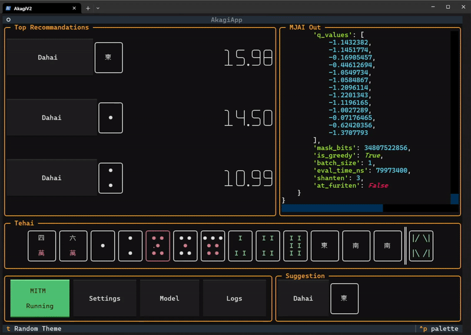

<div align="center">
  
  <h1 align="center">Akagi</h1>

  <div align="center">
  「死ねば助かるのに………」- 赤木しげる<br>
  <div align="center">
  <a href="./README.md">English</a> | <a href="./README_ZH.md">简体中文</a>
  <br/>
  <a href="https://github.com/shinkuan/Akagi/issues">回報錯誤</a> | <a href="https://github.com/shinkuan/Akagi/issues">功能請求</a> | 
  <a href="https://discord.gg/Z2wjXUK8bN">有問題請至 Discord 詢問</a>
  <br/>
  <br/>
  </div>
  </div>
</div>

<div align="center">
  <a href="https://github.com/shinkuan/Akagi"></a>
  <a href="https://github.com/shinkuan/Akagi/releases"></a>
  <a href="https://github.com/shinkuan/Akagi/issues"></a>
  <a href="https://github.com/shinkuan/Akagi"></a>
  <a href="https://discord.gg/Z2wjXUK8bN"></a>
  <a href="https://deepwiki.com/shinkuan/Akagi"></a>
</div>

## 關於

> [!CAUTION]
>
> 本專案旨在提供一個便利的方式，讓玩家可以即時了解自己在麻將對局中的表現，並藉此學習與進步。此專案僅供教育用途，作者不對使用者利用此專案採取的任何行為負責。若使用者違反遊戲服務條款，遊戲開發者與發行商有權進行處置，包含帳號停權等後果，與作者無關。


## 功能

-   即時顯示對局資訊
-   即時顯示 AI 評估
-   支援雀魂、天鳳、麻雀一番街、天月
-   支援四人麻將與三人麻將
-   可使用多種 AI 模型
    -   內建模型
    -   線上伺服器模型
    -   自製模型
-   自動化對局（僅限 Windows Release 版並啟用線上伺服器模型時可用）
-   TUI 介面，支援多種主題

## 目錄

> [!WARNING]
>
> 開始使用前請仔細閱讀

-   [關於](#關於)
-   [功能](#功能)
-   [開始前](#開始前)
    -   [前置要求](#前置要求)
    -   [支援狀況](#支援狀況)
-   [安裝](#安裝)
    -   [一般使用者](#一般使用者)
    -   [開發者](#開發者)

## 開始前

[🎥 教學影片](https://youtu.be/Z88Ncxbe2nw)

### 前置要求

為了使用本專案，你需要準備：

1. 一個 `mjai_bot`
    1. 專案內已內建一個可用的 `mortal` mjai bot，位於 [這裡](./mjai_bot/mortal)
        - 由於倉庫大小限制，`./mjai_bot/mortal` 下的 `mortal.pth` 是縮小版模型
        - 不建議在實戰中使用
        - 若想取得其他模型，可以從 [Discord](https://discord.gg/Z2wjXUK8bN) 取得，裡面提供相當於雀魂雀豪段位的 Mortal V4 模型（~100MB），但你可能需要微調其程式碼以適配本框架。
        - 若想取用更強的 AI 模型，也可以使用線上伺服器架設的模型（即 `ot_server`），這需要從 [Discord](https://discord.gg/Z2wjXUK8bN) 取得 API 金鑰，其水平相當於雀魂魂天段位。
    2. 或自行製作，請參閱 [開發者](#開發者)
2. 使用 Windows Terminal（Windows）/ Terminal（macOS）啟動 Akagi 才能看到漂亮的 TUI。你也可以在設定中停用 TUI，改為啟用 DataServer 進行前後端分離，搭配 [AkagiFrontend](https://github.com/zhuozhiyongde/AkagiFrontend) 顯示對局資訊。這允許你使用 PiP 方式即時查看提示，並在 iOS / iPadOS 等行動裝置上使用，具體部署方法請見後文 [使用方式](#使用方式)。
3. 使用 [Clash Party](https://github.com/mihomo-party-org/clash-party) / [Clash Verge Rev](https://github.com/clash-verge-rev/clash-verge-rev) / [Surge](https://nssurge.com/) 等代理工具將遊戲流量導向 MitM 連接埠，具體分流規則請參閱後文 [使用方式](#使用方式)。

### 支援狀況

目前對各立直麻將平台的支援狀況如下：

| 平台           | 四人麻將 | 三人麻將 | 自動打牌  |
| -------------- | -------- | -------- | --------- |
| **雀魂**       | &check;  | &check;  | \*&check; |
| **天鳳**       | &check;  | &check;  | &cross;   |
| **麻雀一番街** | &check;  | &check;  | \*&check; |
| **天月**       | &check;  | &check;  | \*&check; |

註：自動打牌僅支援 [Windows Release 版](https://github.com/shinkuan/Akagi/releases)，且必須啟用 `ot_server`。

## 安裝

### 一般使用者

Windows 使用者可直接到 [release 頁面](https://github.com/shinkuan/Akagi/releases) 下載最新版，解壓縮後，將 mjai bot 放到 `./Akagi/mjai_bot` 目錄下，然後執行 `run_akagi.exe` 即可。

### 開發者

對於開發者（或 macOS 等其他平台的使用者），可以 clone 本專案，使用 Python 3.12 安裝依賴，將 mjai bot 放到 `./Akagi/mjai_bot` 目錄下，依平台選擇合適的 libriichi 函式庫檔案，最後執行 `run_akagi.py`。

```bash
git clone https://github.com/shinkuan/Akagi.git
cd Akagi
pip install -r requirements.txt
# 對於中國境內使用者，你也可以選擇使用清華源來加速依賴安裝：
# pip install -i https://pypi.tuna.tsinghua.edu.cn/simple -r requirements.txt
mv ./mjai_bot/mortal/libriichi/libriichi-<version>-<platform>.<extension> ./mjai_bot/mortal/libriichi.<extension>
python run_akagi.py
```

關於更多 libriichi 函式庫檔案的選擇：

-   對於 macOS：
    -   M 系列晶片：`libriichi-*-aarch64-apple-darwin.so`
    -   Intel 晶片：`libriichi-*-x86_64-apple-darwin.so`
-   對於 Windows：`libriichi-*-x86_64-pc-windows-msvc.pyd`
-   對於 Linux：`libriichi-*-x86_64-unknown-linux-gnu.so`

注意，其中的 `*` 需要依你的 Python 版本進行選擇。目前提供 Python 3.10/3.11/3.12 的版本，但本專案預設推薦使用 Python 3.12；如果你在其他版本遇到問題，請嘗試改用 Python 3.12。

若需更多資訊或原始碼，可參考 [Mortal](https://github.com/Equim-chan/Mortal) 專案。

## 使用方式

要使用 Akagi，需要做不少準備，請仔細閱讀下文。

### 檢查設定與 AI 模型

1. 選擇模型
    - 點選左下角的 `Model` 按鈕
    - 從清單中選擇一個模型
    - 若沒有模型，可從 [Discord](https://discord.gg/Z2wjXUK8bN) 取得
    - 內建預設模型為弱 AI
    - **3 人對局請選 3P 模型！**
    - **不要用 4P 模型參與 3 人對局！**
2. 檢查設定
    - 點選左下角的 `Settings` 按鈕
    - 確認設定是否正確
    - 將 MitM 類型設定為你正在玩的遊戲
    - 設定正確的 MitM Host 與 Port
    - 若不清楚，請保留預設值
    - 預設值：`host: 127.0.0.1, port: 7880`
    - 若你有取得線上伺服器 API 金鑰（線上伺服器提供更強的 AI 模型，水平相當於雀魂魂天段位），請在設定中輸入；若沒有，可以從 [Discord](https://discord.gg/Z2wjXUK8bN) 取得。
3. 儲存設定
    - 點選 `Save` 按鈕
    - 將設定儲存下來
4. 重新啟動 Akagi
    - 關閉 Akagi 並重新開啟
    - 重新啟動後設定才會套用
5. 啟動 MitM
    - 點選左下角的 `MitM Stopped` 按鈕
    - 這會啟動 MitM 代理伺服器

### 安裝並信任 MitM Proxy 憑證

#### Windows 使用者

1. 開啟檔案總管（按下 `Windows 鍵 + E`）
2. 在上方地址列輸入 `%USERPROFILE%\.mitmproxy`（mitmproxy 的默認憑證儲存路徑）後按 Enter
3. 找到名為 `mitmproxy-ca-cert.cer` 的憑證檔
4. 雙擊該憑證檔
5. 點選 `安裝憑證` 按鈕
6. 若出現選項，請選 `本機電腦`，然後點選下一步
7. 選擇 `將所有憑證放入下列存放區`，然後點 `瀏覽...`
8. 選擇 `受信任的根憑證授權單位`，按下確定，再點選下一步與完成
9. 若系統要求權限，請點選是

#### macOS 使用者

1. 打開 Finder
2. 按下 `Command + Shift + G` 打開「前往資料夾」對話框，輸入 `~/.mitmproxy` 後按 Enter
3. 找到名為 `mitmproxy-ca-cert.cer` 的憑證檔
4. 雙擊該憑證檔，進入「鑰匙圈存取」
5. 點選左邊 `系統鑰匙圈` 下的 `系統` 分頁，右上角搜尋 `mitmproxy`，找到匯入的憑證，此時是未信任狀態
6. 右鍵名為 `mitmproxy` 的憑證項，選擇 `顯示簡介`，在跳出的視窗中展開 `信任`
7. 將 `使用此憑證時` 改為 `永遠信任`
8. 關閉視窗，於彈出的認證框中完成認證即可

#### iOS / iPadOS 使用者

若你透過前後端分離部署將本專案當作代理節點，也能在 iOS / iPadOS 上使用，但仍需在該裝置上完成憑證信任。

1. 先將電腦上的 `mitmproxy-ca-cert.cer` 憑證透過 AirDrop 或其他方式傳送到 iPhone/iPad，最好使用 AirDrop 可自動完成匯入。其他方式需先保存到檔案，再從檔案中點開該憑證。
2. 進入 `設定 > 已下載描述檔`，點擊安裝
3. 前往 `一般 > 關於本機 > 憑證信任設定`，開啟 mitmproxy 的選項

#### Android 使用者

缺乏測試環境，請自行查找相關操作。

### 代理軟體分流

Akagi 預設在本地 `127.0.0.1:7880` 啟動一個 HTTPS 代理（基於 mitmproxy）。推薦使用支援規則分流與覆寫的代理軟體（如 `Mihomo` 系的 `Clash Party` 或 `Clash Verge` / `Surge`），將雀魂相關流量導向該連接埠，並以回避規則讓 Python 行程直連以避免回環。

> [!NOTE]
>
> 若你想與 [MajsoulMax](https://github.com/Avenshy/MajsoulMax) 或 [MajsoulMax-rs](https://github.com/Xerxes-2/MajsoulMax-rs) 聯動，需要搭建串聯代理鏈，詳見後文進階使用部分。

以本地節點 `Akagi`（HTTPS 127.0.0.1:7880）為例，規則中需要讓 Python 行程直連，再把遊戲 / 網頁流量分流到該節點，形成 `Game <-> Akagi <-> Server` 的雙向代理鏈。

#### Clash Party / Clash Verge 設定範例

```yml
proxies:
    - name: Akagi
      type: http
      server: 127.0.0.1
      port: 7880
      tls: true

proxy-groups:
    - name: 🀄 雀魂麻將
      type: select
      proxies:
          - Akagi
          - DIRECT

rules:
    # 避免回環
    - AND, ((PROCESS-NAME-REGEX, python.*?), (OR, ((DOMAIN-KEYWORD, majsoul), (DOMAIN-KEYWORD, maj-soul), (DOMAIN-KEYWORD, mahjongsoul), (DOMAIN-KEYWORD, catmjstudio)))), DIRECT
    # 客戶端 / Steam
    - PROCESS-NAME,Jantama_MahjongSoul.exe,🀄 雀魂麻將
    - PROCESS-NAME,jantama_mahjongsoul.exe,🀄 雀魂麻將
    - PROCESS-NAME,雀魂麻將,🀄 雀魂麻將
    # 網頁版
    - DOMAIN-KEYWORD,majsoul,🀄 雀魂麻將
    - DOMAIN-KEYWORD,maj-soul,🀄 雀魂麻將
    - DOMAIN-KEYWORD,mahjongsoul,🀄 雀魂麻將
    - DOMAIN-KEYWORD,catmjstudio,🀄 雀魂麻將
    - DOMAIN-KEYWORD,catmajsoul,🀄 雀魂麻將
```

#### Surge 設定範例

```text
[Proxy]
Akagi = https, 127.0.0.1, 7880

[Proxy Group]
🀄 雀魂麻將 = select, Akagi, DIRECT

[Rule]
# 避免回環代理
AND, ((PROCESS-NAME, python*), (OR, ((DOMAIN-KEYWORD, majsoul), (DOMAIN-KEYWORD, maj-soul), (DOMAIN-KEYWORD, mahjongsoul), (DOMAIN-KEYWORD, catmjstudio)))), DIRECT
# 客戶端 / Steam
PROCESS-NAME,雀魂麻將,🀄 雀魂麻將
# 網頁版
DOMAIN-KEYWORD,majsoul,🀄 雀魂麻將
DOMAIN-KEYWORD,maj-soul,🀄 雀魂麻將
DOMAIN-KEYWORD,mahjongsoul,🀄 雀魂麻將
DOMAIN-KEYWORD,catmjstudio,🀄 雀魂麻將
DOMAIN-KEYWORD,catmajsoul,🀄 雀魂麻將
```

#### Clash Verge 全域擴展腳本（JS）範例

參考 [官方文件](https://www.clashverge.dev/guide/script.html)，可按下列方式設定。

在「訂閱」頁面右鍵 `全域擴展腳本`，選擇「編輯檔案」：

```js
function main(config) {
    config.proxies.push({
        name: 'Akagi',
        type: 'http',
        server: '127.0.0.1',
        port: 7880,
        tls: true,
    });

    config['proxy-groups'].push({
        name: '🀄 雀魂麻將',
        type: 'select',
        proxies: ['DIRECT', 'Akagi'],
        icon: 'https://www.maj-soul.com/homepage/img/logotaiwan.png',
    });

    const bypass = [
        'AND, ((PROCESS-NAME-REGEX, python.*?), (OR, ((DOMAIN-KEYWORD, majsoul), (DOMAIN-KEYWORD, maj-soul), (DOMAIN-KEYWORD, mahjongsoul), (DOMAIN-KEYWORD, catmjstudio)))), DIRECT',
    ];

    const clientRules = [
        'PROCESS-NAME,Jantama_MahjongSoul.exe,🀄 雀魂麻將',
        'PROCESS-NAME,jantama_mahjongsoul.exe,🀄 雀魂麻將',
        'PROCESS-NAME,雀魂麻將,🀄 雀魂麻將',
    ];

    const webRules = [
        'DOMAIN-KEYWORD,majsoul,🀄 雀魂麻將',
        'DOMAIN-KEYWORD,maj-soul,🀄 雀魂麻將',
        'DOMAIN-KEYWORD,mahjongsoul,🀄 雀魂麻將',
        'DOMAIN-KEYWORD,catmjstudio,🀄 雀魂麻將',
        'DOMAIN-KEYWORD,catmajsoul,🀄 雀魂麻將',
    ];

    config.rules.unshift(...bypass, ...clientRules, ...webRules);
    return config;
}
```

#### Clash Party（原 Mihomo Party）覆寫 YAML 範例

參考 [官方文件](https://clashparty.org/docs/guide/override/yaml)，可按照下列方式設定。

在 Clash Party 左側「覆寫」頁面點選 `+`，選擇「新建 YAML」，然後複製以下內容，點選「確認」儲存，再點擊對應覆寫卡片右上角的 `...`，選擇「編輯資訊」-「全域啟用」。

```yml
# https://mihomo.party/docs/guide/override/yaml
+proxies:
    - name: Akagi
      type: http
      server: 127.0.0.1
      port: 7880
      tls: true
+proxy-groups:
    - name: 🀄 雀魂麻將
      proxies:
          - Akagi
          - DIRECT
      type: select
+rules:
    - AND, ((PROCESS-NAME-REGEX, python.*?), (OR, ((DOMAIN-KEYWORD, majsoul), (DOMAIN-KEYWORD, maj-soul), (DOMAIN-KEYWORD, mahjongsoul), (DOMAIN-KEYWORD, catmjstudio)))), DIRECT
    - PROCESS-NAME,Jantama_MahjongSoul.exe,🀄 雀魂麻將
    - PROCESS-NAME,jantama_mahjongsoul.exe,🀄 雀魂麻將
    - PROCESS-NAME,雀魂麻將,🀄 雀魂麻將
    - DOMAIN-KEYWORD,majsoul,🀄 雀魂麻將
    - DOMAIN-KEYWORD,maj-soul,🀄 雀魂麻將
    - DOMAIN-KEYWORD,mahjongsoul,🀄 雀魂麻將
    - DOMAIN-KEYWORD,catmjstudio,🀄 雀魂麻將
    - DOMAIN-KEYWORD,catmajsoul,🀄 雀魂麻將
```

### 啟動對局

完成上述流程後，應可正常進行遊戲並獲得 AI 分析。建議先在人機對戰中測試是否運作正常。

若遇到問題，請先檢查 Akagi 目錄下 `logs` 目錄的日誌以排除錯誤；若仍無法解決，可至 [Discord](https://discord.gg/Z2wjXUK8bN) 求助或在 Issue 中提問。

## 進階使用

### DataServer

DataServer 是 Akagi 新增的可選功能，預設啟用。它可以作為 SSE（Server Sent Events）伺服器，將 AI 分析結果即時推送給前端頁面。若要在 iOS / iPadOS 等行動端使用後端部署模式，必須開啟此功能。

要開啟 DataServer，可在設定中（透過 TUI 或修改 `settings/settings.json` 的 `dataserver` 欄位為 `true`）啟用，然後重新啟動 Akagi。

啟動 DataServer 後，Akagi 會在 `0.0.0.0:8765` 啟動 SSE 伺服器，之後可使用 [AkagiFrontend](https://github.com/zhuozhiyongde/AkagiFrontend) 作為前端展示，實現前後端分離，並使用 PiP（畫中畫）取代 TUI 顯示結果。對電腦端來說這不是必須，但對行動端則是唯一方式。

若你想在 VPS 上將 Akagi 完全作為後端服務部署，並停用 TUI，也可以在設定中（透過 TUI 或修改 `settings/settings.json` 的 `tui` 欄位為 `false`）關閉 TUI，然後重新啟動 Akagi。此時只能透過 DataServer 的 SSE 服務埠取得結果。

若同時停用 DataServer 與 TUI，就無法取得模型推理結果。

### 與 MajsoulMax 聯動

MajsoulMax 是用於解鎖雀魂外觀的專案，原理與 Akagi 類似，都是透過 MITM 代理攔截遊戲流量後處理。因兩者都需要 MitM，需要配置代理鏈讓流量串行經過兩個節點，並同時信任兩份憑證，尤其要避免回環代理。

MajsoulMax 有兩個版本：[Python](https://github.com/Avenshy/MajsoulMax) 與 [Rust](https://github.com/Xerxes-2/MajsoulMax-rs)。

對應地，這裡也提供基於 MajsoulMax-rs 和基於 MajsoulMax 的兩種設定，差異在於：

1. MajsoulMax-rs（Rust）啟動的是 HTTP 代理（基於 hudsucker），鏈式代理初始化可能會遇到問題，但分流簡單、使用方便、無需處理環境依賴。
2. MajsoulMax（Python）啟動的是 HTTPS 代理（基於 mitmproxy），可以完美進行鏈式代理。

#### Rust 版本設定

Rust 版本代理鏈如下：

```
Game <-> majsoul_max_rs(23410, http) <-> akagi(7880, https) <-> Server
```

分流完全依賴你的代理軟體，示例設定如下：

Clash：

```yaml
proxies:
    - name: MajsoulMax
      port: 23410
      server: 127.0.0.1
      tls: false
      type: http
    - name: Akagi
      port: 7880
      server: 127.0.0.1
      tls: true
      type: http
proxy-groups:
    - name: 🀄 雀魂麻將
      proxies:
          - MajsoulMax
          - DIRECT
      type: select
rules:
    # 避免 Akagi 回環代理
    - AND, ((PROCESS-NAME-REGEX, python.*?), (OR, ((DOMAIN-KEYWORD, majsoul), (DOMAIN-KEYWORD, maj-soul), (DOMAIN-KEYWORD, mahjongsoul), (DOMAIN-KEYWORD, catmjstudio)))), DIRECT
    # 強制將 majsoul_max_rs 的流量導向 akagi
    - PROCESS-NAME-REGEX,majsoul_max_rs.*?,Akagi
    # 將雀魂遊戲流量分流
    # 客戶端 / Steam
    - PROCESS-NAME,Jantama_MahjongSoul.exe,🀄 雀魂麻將
    - PROCESS-NAME,jantama_mahjongsoul.exe,🀄 雀魂麻將
    - PROCESS-NAME,雀魂麻將,🀄 雀魂麻將
    # 網頁端
    - DOMAIN-KEYWORD,majsoul,🀄 雀魂麻將
    - DOMAIN-KEYWORD,maj-soul,🀄 雀魂麻將
    - DOMAIN-KEYWORD,mahjongsoul,🀄 雀魂麻將
    - DOMAIN-KEYWORD,catmjstudio,🀄 雀魂麻將
    - DOMAIN-KEYWORD,catmajsoul,🀄 雀魂麻將
```

Surge：

```text
[Proxy]
MajsoulMax = http, 127.0.0.1, 23410
Akagi = http, 127.0.0.1, 7880

[Proxy Group]
🀄 雀魂麻將 = select, MajsoulMax, DIRECT

[Rule]
AND, ((PROCESS-NAME-REGEX, python.*?), (OR, ((DOMAIN-KEYWORD, majsoul), (DOMAIN-KEYWORD, maj-soul), (DOMAIN-KEYWORD, mahjongsoul), (DOMAIN-KEYWORD, catmjstudio)))), DIRECT
PROCESS-NAME,majsoul_max_rs,Akagi
# 客戶端 / Steam
PROCESS-NAME,雀魂麻將,🀄 雀魂麻將
# 網頁版
DOMAIN-KEYWORD,majsoul,🀄 雀魂麻將
DOMAIN-KEYWORD,maj-soul,🀄 雀魂麻將
DOMAIN-KEYWORD,mahjongsoul,🀄 雀魂麻將
DOMAIN-KEYWORD,catmjstudio,🀄 雀魂麻將
DOMAIN-KEYWORD,catmajsoul,🀄 雀魂麻將
```

#### Python 版本設定

Python 版本代理鏈如下：

```
Game <-> MajsoulMax(23410, https) <-> akagi(7880, https) <-> Server
```

注意，MajsoulMax（Python）與 Akagi 在 `protobuf` 版本要求上不同，必須使用兩個獨立環境或使用 Vendor 控制該依賴。

> 或者你也可以直接使用 [MajsoulHelper](https://github.com/zhuozhiyongde/MajsoulHelper) 以容器化方式同時啟動兩者。

此時需指定 upstream 為 Akagi 的連接埠並允許不安全連線來啟動 MajsoulMax，也就是上述代理鏈中的第二個 `<->` 需透過代理軟體之外的方式完成：

```shell
mitmdump -p 23410 --mode upstream:http://127.0.0.1:7880 -s addons.py --ssl-insecure
```

示例設定如下：

Clash：

```yaml
proxies:
    - name: MajsoulMax
      port: 23410
      server: 127.0.0.1
      tls: true
      type: http
proxy-groups:
    - name: 🀄 雀魂麻將
      proxies:
          - MajsoulMax
          - DIRECT
      type: select
rules:
    # 避免 Akagi、MajsoulMax 回環代理
    - AND, ((PROCESS-NAME-REGEX, python.*?), (OR, ((DOMAIN-KEYWORD, majsoul), (DOMAIN-KEYWORD, maj-soul), (DOMAIN-KEYWORD, mahjongsoul), (DOMAIN-KEYWORD, catmjstudio)))), DIRECT
    # 將雀魂遊戲流量分流
    # 客戶端 / Steam
    - PROCESS-NAME,Jantama_MahjongSoul.exe,🀄 雀魂麻將
    - PROCESS-NAME,jantama_mahjongsoul.exe,🀄 雀魂麻將
    - PROCESS-NAME,雀魂麻將,🀄 雀魂麻將
    # 網頁端
    - DOMAIN-KEYWORD,majsoul,🀄 雀魂麻將
    - DOMAIN-KEYWORD,maj-soul,🀄 雀魂麻將
    - DOMAIN-KEYWORD,mahjongsoul,🀄 雀魂麻將
    - DOMAIN-KEYWORD,catmjstudio,🀄 雀魂麻將
    - DOMAIN-KEYWORD,catmajsoul,🀄 雀魂麻將
```

Surge：

```text
[Proxy]
MajsoulMax = https, 127.0.0.1, 23410

[Proxy Group]
🀄 雀魂麻將 = select, MajsoulMax, DIRECT

[Rule]
AND, ((PROCESS-NAME-REGEX, python.*?), (OR, ((DOMAIN-KEYWORD, majsoul), (DOMAIN-KEYWORD, maj-soul), (DOMAIN-KEYWORD, mahjongsoul), (DOMAIN-KEYWORD, catmjstudio)))), DIRECT
# 客戶端 / Steam
PROCESS-NAME,雀魂麻將,🀄 雀魂麻將
# 網頁版
DOMAIN-KEYWORD,majsoul,🀄 雀魂麻將
DOMAIN-KEYWORD,maj-soul,🀄 雀魂麻將
DOMAIN-KEYWORD,mahjongsoul,🀄 雀魂麻將
DOMAIN-KEYWORD,catmjstudio,🀄 雀魂麻將
DOMAIN-KEYWORD,catmajsoul,🀄 雀魂麻將
```

## 操作演示

### 啟動 MitM 代理伺服器


### 選擇 AI 模型

模型儲存在 `./mjai_bot/` 資料夾


### 變更設定

> [!IMPORTANT]
>
> 重新啟動後設定才會被套用


### 開啟日誌

出現問題時可開啟日誌以了解狀況，並同時向開發者回報。

儲存路徑：`./logs/`


### 切換 MJAI 視窗

點選該視窗即可切換



### AutoPlay

> [!NOTE]
>
> AutoPlay 只在 Windows Release 版啟用，且必須啟動 ot_server。

確保遊戲客戶端的顯示比例設定為 16:9


### 更換主題


### 立直宣告

因 MJAI 協議限制，建議欄為立直時不會顯示棄牌。

你必須手動點擊立直按鈕來宣告立直。


## 常見問題

可至 [Discord](https://discord.gg/Z2wjXUK8bN) 或 Issue 頁面詢問問題。

> [!TIP]
>
> 若有任何問題，請附上日誌檔案，這樣我才能更快協助你。
>
> 日誌檔位於 `./logs/` 資料夾。

### MitM Proxy 無法啟動

-   確認是否有其他應用占用連接埠
-   確認是否已安裝並信任 MitM Proxy 憑證
-   確認設定的 Host 與 Port 是否正確
-   確認是否有防火牆阻擋 MitM Proxy
-   確認 MitM Proxy Server 是否已啟動
-   若仍無法啟動，請參考 [這個 Issue](https://github.com/shinkuan/Akagi/issues/57)

## 開發

### 專案結構

```shell
.
├── akagi # Akagi 的 Textual UI
├── autoplay # AutoPlay 的實作
├── dataserver # DataServer 的實作
├── logs # 日誌儲存目錄
├── mitm # MitM 代理伺服器
│   ├── bridge # 遊戲客戶端與伺服器的橋接器，用來轉換為 MJAI 協議
│   │   ├── amatsuki # 天月橋接器
│   │   ├── majsoul # 雀魂橋接器
│   │   ├── riichi_city # 一番街橋接器
│   │   ├── tenhou # 天鳳橋接器
│   │   └── unified # 統一橋接器
├── mjai_bot # MJAI 機器人
│   ├── base # 機器人基礎類別，可參考自製機器人
│   ├── mortal # 預設的四人麻將模型
│   └── mortal3p # 預設的三人麻將模型
├── settings # 設定資料夾
└── run_akagi.py # 啟動程式
```

### 橋接器

要製作橋接器，需要實作兩部分：

1. `mitm/bridge/mitm_abc.py` 中的 `ClientWebSocketABC`
2. `mitm/bridge/bridge_base.py` 中的 `Bridge`

ClientWebSocketABC 是 mitmproxy 的 addon，功能是將遊戲協議轉為 MJAI 協議並推入 `mjai_messages: queue.Queue[dict] = queue.Queue()`。可參考 `mitm/majsoul/`。

Bridge 為橋接主類別，你需要實作 `parse()` 方法，將遊戲收到的資料解析為 `None | list[dict]`，可參考 `mitm/bridge/amatsuki/bridge.py`。

### MJAI 機器人

要製作 MJAI 機器人，需要實作 `mjai_bot/base/bot.py` 中的 `Bot` 類別。

> TODO: 製作一個 tsumogiri bot 範例

## TODO

-   [x] 支援三人麻將
-   [x] 支援 RiichiCity
-   [x] 立直後推薦切牌
-   [ ] 槓後推薦切牌（極少見）

## 作者

-   [Shinkuan](https://github.com/shinkuan/) - shinkuan318@gmail.com
-   [Discord](https://discord.gg/Z2wjXUK8bN)

## 授權條款

```
“Commons Clause” License Condition v1.0

The Software is provided to you by the Licensor under the License, as defined below, subject to the following condition.

Without limiting other conditions in the License, the grant of rights under the License will not include, and the License does not grant to you, the right to Sell the Software.

For purposes of the foregoing, “Sell” means practicing any or all of the rights granted to you under the License to provide to third parties, for a fee or other consideration (including without limitation fees for hosting or consulting/ support services related to the Software), a product or service whose value derives, entirely or substantially, from the functionality of the Software. Any license notice or attribution required by the License must also include this Commons Clause License Condition notice.

Software: Akagi

License: GNU Affero General Public License version 3 with Commons Clause

Licensor: shinkuan
```
