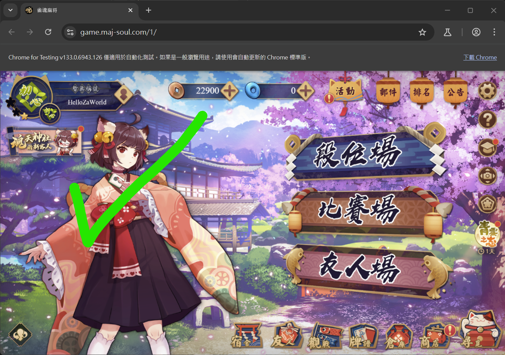
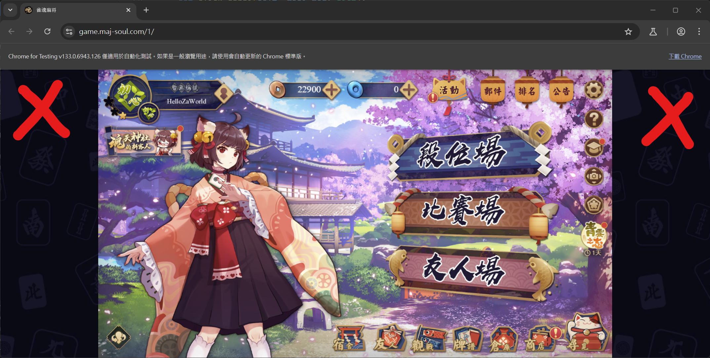
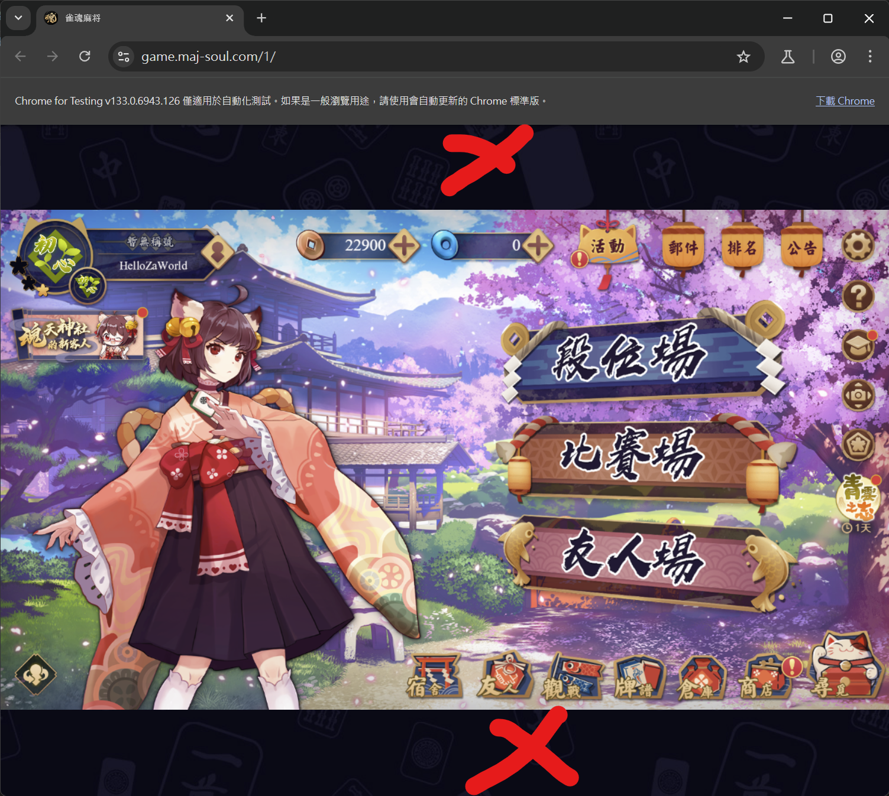

<div align="center">
  
  <h1 align="center">Akagi</h1>

  <div align="center">
  「死ねば助かるのに………」- 赤木しげる<br>
  <div align="center">
  <a href="./README.md">English</a> | <a href="./README_TW.md">繁體中文</a>
  <br/>
  <a href="https://github.com/shinkuan/Akagi/issues">报告错误</a> | <a href="https://github.com/shinkuan/Akagi/issues">功能请求</a> | 
  <a href="https://discord.gg/Z2wjXUK8bN">有问题请至 Discord 询问</a>
  <br/>
  <br/>
  </div>
  </div>
</div>

<div align="center">
  <a href="https://github.com/shinkuan/Akagi"></a>
  <a href="https://github.com/shinkuan/Akagi/releases"></a>
  <a href="https://github.com/shinkuan/Akagi/issues"></a>
  <a href="https://github.com/shinkuan/Akagi"></a>
  <a href="https://discord.gg/Z2wjXUK8bN"></a>
  <a href="https://deepwiki.com/shinkuan/Akagi"></a>
</div>

## 关于

> [!CAUTION]
>
> 本项目旨在提供一个便利的方式，让玩家可以实时了解自己在麻将对局中的表现，并借此学习与进步。此项目仅供教育用途，作者不对使用者利用此项目采取的任何行为负责。若使用者违反游戏服务条款，游戏开发者与发行商有权进行处置，包含账号封禁等后果，与作者无关。


## 功能

-   实时显示对局信息
-   实时显示 AI 评估
-   支持雀魂、天凤、麻雀一番街、天月
-   支持四人麻将与三人麻将
-   可使用多种 AI 模型
    -   内建模型
    -   在线服务器模型
    -   自制模型
-   自动化对局（只有在 Windows Release 版中开启在线服务器模型时可用）
-   TUI 界面，支持多种主题

## 目录

> [!WARNING]
>
> 仔细阅读以下内容再开始使用

-   [关于](##关于)
-   [功能](##功能)
-   [开始前](##开始前)
    -   [前置要求](##前置要求)
    -   [支持状况](##支持状况)
-   [安装](##安装)
    -   [一般使用者](##一般使用者)
    -   [开发者](##开发者)

## 开始前

[🎥 教学视频](https://youtu.be/Z88Ncxbe2nw)

### 前置要求

为了使用本项目，你需要准备：

1. 一个 `mjai_bot`
    1. 此项目已经包含一个可用的 `mortal` mjai bot 在 [这边](./mjai_bot/mortal)
        - 由于仓库大小限制，在 `./mjai_bot/mortal` 下的 `mortal.pth` 是一个较小的模型
        - 不建议在实际对局中使用
        - 若想取得其他模型，可以从 [Discord](https://discord.gg/Z2wjXUK8bN) 取得，这里提供了相当于雀魂雀豪段位的 Mortal V4 模型（~100MB），但是你可能需要略微修改其代码以适配本框架。
        - 若想取用更强的 AI 模型，也可以使用在线服务器架设的模型（即 `ot_server`），这需要从 [Discord](https://discord.gg/Z2wjXUK8bN) 取得 API 密钥，其水平相当于雀魂魂天段位。
    2. 或自行制作，请参阅 [开发者](#开发者)
2. 使用 Windows Terminal(Windows) / Terminal(macOS) 开启 Akagi 才能看到漂亮的 TUI，您也可以选择在配置中禁用 TUI 界面，转为启用 DataServer 进行前后端分离，使用 [AkagiFrontend](https://github.com/zhuozhiyongde/AkagiFrontend) 来显示对局信息。这将允许您使用 PiP 画中画模式实时查看提示，从而在 iOS / iPadOS 等移动端设备上使用，具体部署方法请参阅后文 [使用方式](##使用方式) 中的说明。
3. 使用 [Clash Party](https://github.com/mihomo-party-org/clash-party) / [Clash Verge Rev](https://github.com/clash-verge-rev/clash-verge-rev) / [Surge](https://nssurge.com/) 等代理工具将游戏流量导向 MitM 端口，具体分流规则请参阅后文 [使用方式](##使用方式) 中的说明。

### 支持状况

现在对于各立直麻将平台的支持状况如下：

| 平台           | 四人麻将 | 三人麻将 | 自动打牌  |
| -------------- | -------- | -------- | --------- |
| **雀魂**       | &check;  | &check;  | \*&check; |
| **天凤**       | &check;  | &check;  | &cross;   |
| **麻雀一番街** | &check;  | &check;  | \*&check; |
| **天月**       | &check;  | &check;  | \*&check; |

注：自动打牌仅支持 [Windows Release 版](https://github.com/shinkuan/Akagi/releases)，且 `ot_server` 必须启用。

## 安装

### 一般使用者

对于 Windows 平台的用户，可以直接下载 [release 页面](https://github.com/shinkuan/Akagi/releases) 中的最新版，解压缩后，将 mjai bot 放到 `./Akagi/mjai_bot` 目录下，然后运行 `run_akagi.exe` 即可。

### 开发者

对于开发者（或 macOS 等其他平台的用户），可以 clone 此项目，然后使用 Python 3.12 安装依赖，再将 mjai bot 放到 `./Akagi/mjai_bot` 目录下，根据你的平台，选择适当的 libriichi 库文件，然后运行 `run_akagi.py` 即可。

```bash
git clone https://github.com/shinkuan/Akagi.git
cd Akagi
pip install -r requirements.txt
# 对于国内用户，你也可以选择使用清华源来加速依赖安装：
# pip install -i https://pypi.tuna.tsinghua.edu.cn/simple -r requirements.txt
mv ./mjai_bot/mortal/libriichi/libriichi-<version>-<platform>.<extension> ./mjai_bot/mortal/libriichi.<extension>
python run_akagi.py
```

关于更多 libriichi 库文件的选择：

-   对于 macOS：
    -   M 系列芯片：`libriichi-*-aarch64-apple-darwin.so`
    -   Intel 芯片：`libriichi-*-x86_64-apple-darwin.so`
-   对于 Windows：`libriichi-*-x86_64-pc-windows-msvc.pyd`
-   对于 Linux：`libriichi-*-x86_64-unknown-linux-gnu.so`

注意，其中的 `*` 需要根据你的 Python 版本进行选择，目前提供了 Python 3.10/3.11/3.12 的版本，但本项目默认推荐使用 Python 3.12，如果您在其他 Python 版本上遇到了问题，请尝试使用 Python 3.12 的版本。

如果需要获取更多信息 / 源码，可参考 [Mortal](https://github.com/Equim-chan/Mortal) 项目。

## 使用方式

为了使用 Akagi，你需要进行较多的准备工作，请仔细阅读下文。

### 检查配置与 AI 模型

1. 选择模型
    - 点选左下角的 `Model` 按钮
    - 从清单中选择一个模型
    - 若没有模型，可从 [Discord](https://discord.gg/Z2wjXUK8bN) 取得
    - 内建预设模型为弱 AI
    - **3 人对局请选择 3P 模型！**
    - **不要用 4P 模型参与 3 人对局！**
2. 检查设定
    - 点选左下角的 `Settings` 按钮
    - 检查设定是否正确
    - 将 MitM 类型设定为你正在玩的游戏
    - 设定正确的 MitM Host 与 Port
    - 若不清楚，请保留预设值
    - 预设值: `host: 127.0.0.1, port: 7880`
    - 若你有取得在线服务器 API 密钥（在线服务器提供更强的 AI 模型，其水平相当于雀魂魂天段位），请在配置中输入，若你没有 API 密钥，可以从 [Discord](https://discord.gg/Z2wjXUK8bN) 获取。
3. 保存设定
    - 点选 `Save` 按钮
    - 将设定保存下来
4. 重新启动 Akagi
    - 关闭 Akagi 并重新开启
    - 配置才会被应用
5. 启动 MitM
    - 点选左下角的 `MitM Stopped` 按钮
    - 这会启动 MitM 代理服务器

### 安装并信任 MitM Proxy 证书

#### Windows 用户

1. 开启文件资源管理器（按下 `Windows 键 + E`）
2. 在上方地址栏输入 `%USERPROFILE%\.mitmproxy`（mitmproxy 的默认证书存储路径）然后按 Enter
3. 找到名为 `mitmproxy-ca-cert.cer` 的证书文件
4. 双击该证书文件
5. 点选 `安装证书` 按钮
6. 若出现选项，请选 `本地计算机`，然后点选下一步
7. 选择 `将所有证书放入下列存储`，然后点 `浏览...`
8. 选择 `受信任的根证书颁发机构`，按下确定，再点选下一步与完成
9. 若系统要求权限，请点选是

#### macOS 用户

1. 打开 Finder
2. 按下 `Command + Shift + G` 打开前往文件夹对话框，输入 `~/.mitmproxy` 然后按 Enter
3. 找到名为 `mitmproxy-ca-cert.cer` 的证书文件
4. 双击该证书文件，进入钥匙串访问
5. 点选左边的 `系统钥匙串` 下的 `系统` 标签，右上角搜索 `mitmproxy`，找到导入的证书，此时是未信任状态
6. 右键名为 `mitmproxy` 的证书项，选择 `显示简介`，在弹出的窗口中展开 `信任`
7. 对于 `使用此证书时`，改为 `始终信任`
8. 关闭窗口，在弹出的认证框中完成认证即可。

#### iOS / iPadOS 用户

若你通过分离部署的形式将本项目改为了代理节点，则可以在 iOS / iPadOS 上使用，但此时仍需在对应设备上完成证书信任。

1. 首先将电脑上的 `mitmproxy-ca-cert.cer` 证书通过隔空传送或者其他方式发送到 iPhone/iPad 上，最好是隔空投送，可以自动完成导入。对于其他方式，须先保存到文件中，然后再在文件中点开该证书文件。
2. 进入 `设置-已下载描述文件`，点击安装
3. 前往 `通用-关于本机-证书信任设置`，打开 mitmproxy 的选项

#### Android 用户

无测试环境，可自行搜索。

### 代理软件分流

Akagi 默认在本地 `127.0.0.1:7880` 启动一个 HTTPS 代理（基于 mitmproxy）。推荐使用支持规则分流和覆写的代理软件（如 `Mihomo` 系的 `Clash Party` 或 `Clash Verge` / `Surge`），将雀魂相关流量导向该端口，并使用复合规则给 Python 进程做直连以避免回环。

> [!NOTE]
>
> 如果你想要联动使用 [MajsoulMax](https://github.com/Avenshy/MajsoulMax) 或 [MajsoulMax-rs](https://github.com/Xerxes-2/MajsoulMax-rs) 项目使用，需要搭建复合代理链，具体请参阅后文进阶使用部分。

以本地节点 `Akagi`（HTTPS 127.0.0.1:7880）为例，规则中需要让 Python 进程直连，再把游戏 / 网页流量分流到该节点，即形成 `Game <-> Akagi <-> Server` 的双向代理链条。

#### Clash Party / Clash Verge 配置示例

```yml
proxies:
    - name: Akagi
      type: http
      server: 127.0.0.1
      port: 7880
      tls: true

proxy-groups:
    - name: 🀄 雀魂麻将
      type: select
      proxies:
          - Akagi
          - DIRECT

rules:
    # 避免回环
    - AND, ((PROCESS-NAME-REGEX, python.*?), (OR, ((DOMAIN-KEYWORD, majsoul), (DOMAIN-KEYWORD, maj-soul), (DOMAIN-KEYWORD, mahjongsoul), (DOMAIN-KEYWORD, catmjstudio)))), DIRECT
    # 客户端 / Steam
    - PROCESS-NAME,Jantama_MahjongSoul.exe,🀄 雀魂麻将
    - PROCESS-NAME,jantama_mahjongsoul.exe,🀄 雀魂麻将
    - PROCESS-NAME,雀魂麻將,🀄 雀魂麻将
    # 网页版
    - DOMAIN-KEYWORD,majsoul,🀄 雀魂麻将
    - DOMAIN-KEYWORD,maj-soul,🀄 雀魂麻将
    - DOMAIN-KEYWORD,mahjongsoul,🀄 雀魂麻将
    - DOMAIN-KEYWORD,catmjstudio,🀄 雀魂麻将
```

#### Surge 配置示例

```text
[Proxy]
Akagi = https, 127.0.0.1, 7880

[Proxy Group]
🀄 雀魂麻将 = select, Akagi, DIRECT

[Rule]
# 避免回环代理
AND, ((PROCESS-NAME, python*), (OR, ((DOMAIN-KEYWORD, majsoul), (DOMAIN-KEYWORD, maj-soul), (DOMAIN-KEYWORD, mahjongsoul), (DOMAIN-KEYWORD, catmjstudio)))), DIRECT
# 客户端 / Steam
PROCESS-NAME,雀魂麻將,🀄 雀魂麻将
# 网页版
DOMAIN-KEYWORD,majsoul,🀄 雀魂麻将
DOMAIN-KEYWORD,maj-soul,🀄 雀魂麻将
DOMAIN-KEYWORD,mahjongsoul,🀄 雀魂麻将
DOMAIN-KEYWORD,catmjstudio,🀄 雀魂麻将
```

#### Clash Verge 全局扩展脚本（JS）示例

参考 [官方文档](https://www.clashverge.dev/guide/script.html)，可以按照如下方法进行配置。

在 “订阅” 页面右键 `全局扩展脚本`，选择 “编辑文件”:

```js
function main(config) {
    config.proxies.push({
        name: 'Akagi',
        type: 'http',
        server: '127.0.0.1',
        port: 7880,
        tls: true,
    });

    config['proxy-groups'].push({
        name: '🀄 雀魂麻将',
        type: 'select',
        proxies: ['DIRECT', 'Akagi'],
        icon: 'https://www.maj-soul.com/homepage/img/logotaiwan.png',
    });

    const bypass = [
        'AND, ((PROCESS-NAME-REGEX, python.*?), (OR, ((DOMAIN-KEYWORD, majsoul), (DOMAIN-KEYWORD, maj-soul), (DOMAIN-KEYWORD, mahjongsoul), (DOMAIN-KEYWORD, catmjstudio)))), DIRECT',
    ];

    const clientRules = [
        'PROCESS-NAME,Jantama_MahjongSoul.exe,🀄 雀魂麻将',
        'PROCESS-NAME,jantama_mahjongsoul.exe,🀄 雀魂麻将',
        'PROCESS-NAME,雀魂麻將,🀄 雀魂麻将',
    ];

    const webRules = [
        'DOMAIN-KEYWORD,majsoul,🀄 雀魂麻将',
        'DOMAIN-KEYWORD,maj-soul,🀄 雀魂麻将',
        'DOMAIN-KEYWORD,mahjongsoul,🀄 雀魂麻将',
        'DOMAIN-KEYWORD,catmjstudio,🀄 雀魂麻将',
    ];

    config.rules.unshift(...bypass, ...clientRules, ...webRules);
    return config;
}
```

#### Clash Party（原 Mihomo Party）覆写 YAML 示例

参考 [官方文档](https://clashparty.org/docs/guide/override/yaml)，可以按照如下方式进行配置。

在 Clash Party 左侧 `覆写` 页面点击 `+` 号，选择 `新建 YAML`，然后复制如下内容，点击 `确认` 保存，然后点击对应覆写卡片右上角的 `...` 图标，选择 `编辑信息` - `全局启用`。

```yml
# https://mihomo.party/docs/guide/override/yaml
+proxies:
    - name: Akagi
      type: http
      server: 127.0.0.1
      port: 7880
      tls: true
+proxy-groups:
    - name: 🀄 雀魂麻将
      proxies:
          - Akagi
          - DIRECT
      type: select
+rules:
    - AND, ((PROCESS-NAME-REGEX, python.*?), (OR, ((DOMAIN-KEYWORD, majsoul), (DOMAIN-KEYWORD, maj-soul), (DOMAIN-KEYWORD, mahjongsoul), (DOMAIN-KEYWORD, catmjstudio)))), DIRECT
    - PROCESS-NAME,Jantama_MahjongSoul.exe,🀄 雀魂麻将
    - PROCESS-NAME,jantama_mahjongsoul.exe,🀄 雀魂麻将
    - PROCESS-NAME,雀魂麻將,🀄 雀魂麻将
    - DOMAIN-KEYWORD,majsoul,🀄 雀魂麻将
    - DOMAIN-KEYWORD,maj-soul,🀄 雀魂麻将
    - DOMAIN-KEYWORD,mahjongsoul,🀄 雀魂麻将
    - DOMAIN-KEYWORD,catmjstudio,🀄 雀魂麻将
```

### 启动对局

完成上述流程后，你应当就可以进行游戏对局并获得 AI 分析了。建议先进行人机对局以测试是否正常工作。

如果遇到任何问题，请首先检查 Akagi 目录下的 `logs` 目录下的日志，排查是否有错误信息，如果无法解决，可以考虑到 [Discord](https://discord.gg/Z2wjXUK8bN) 寻求帮助，或在 Issue 中提出。

## 进阶使用

### DataServer

DataServer 是 Akagi 新增的可选功能，默认开启，其可以作为 SSE（Server Sent Events）服务器，将 AI 分析结果实时推送给前端页面进行展示。这对于使用服务端部署并在 iOS / iPadOS 上使用是必要的。

为了开启 DataServer，你需要在设置中（可以通过 TUI 或者修改 `settings/settings.json` 文件中的 `dataserver` 字段为 `true`）开启该功能，然后重新启动 Akagi。

启动 DataServer 后，Akagi 会在 `0.0.0.0:8765` 启动 SSE 服务器，从而你可以使用 [AkagiFrontend](https://github.com/zhuozhiyongde/AkagiFrontend) 作为前端展示，完成前后端分离，并得以使用 PiP（画中画）功能而非 TUI 来作为结果展示。这对于电脑端是非必须的，但是对于移动端是唯一的使用方式。

如果你使用想要使用 VPS 将 Akagi 完全作为后端服务部署，并且禁用 TUI，你也可以在设置中（还是通过 TUI 或者修改 `settings/settings.json` 文件中的 `tui` 字段为 `false`）关闭该功能，然后重新启动 Akagi。此时你只能通过 DataServer 的 SSE 服务端口获取结果。

如果你同时禁用了 DataServer 和 TUI，那么你将无法获取模型推理结果。

### 与 MajsoulMax 联动

MajsoulMax 是一个用于解锁雀魂皮肤的项目，其原理和 Akagi 类似，都是通过 MITM 代理服务器拦截游戏流量，然后进行处理。由于二者都需要进行 MitM，所以你需要配置代理链让流量串行经过两个节点，并且需要同时信任二者的证书。此时尤其需要注意避免回环代理的问题。

MajsoulMax 存在两个分支版本：[Python](https://github.com/Avenshy/MajsoulMax) 和 [Rust](https://github.com/Xerxes-2/MajsoulMax-rs)。

对应的，这里也有基于 MajsoulMax-rs 和基于 MajsoulMax 的两种配置，配置相近，不同点在于：

1. MajsoulMax-rs（Rust）启动的是 HTTP 代理（基于 hudsucker），且链式代理时，初始化的时候可能会遇到问题，但是分流简单、使用方便、无需环境依赖管理。
2. MajsoulMax（Python）启动的是 HTTPS 代理（基于 mitmproxy），可以完美进行链式代理。

#### Rust 版本配置

Rust 版本代理链条如下：

```
Game <-> majsoul_max_rs(23410, http) <-> akagi(7880, https) <-> Server
```

这里分流完全依赖于你的代理软件，示例配置如下：

Clash：

```yaml
proxies:
    - name: MajsoulMax
      port: 23410
      server: 127.0.0.1
      tls: false
      type: http
    - name: Akagi
      port: 7880
      server: 127.0.0.1
      tls: true
      type: http
proxy-groups:
    - name: 🀄 雀魂麻将
      proxies:
          - MajsoulMax
          - DIRECT
      type: select
rules:
    # 避免 Akagi 回环代理
    - AND, ((PROCESS-NAME-REGEX, python.*?), (OR, ((DOMAIN-KEYWORD, majsoul), (DOMAIN-KEYWORD, maj-soul), (DOMAIN-KEYWORD, mahjongsoul), (DOMAIN-KEYWORD, catmjstudio)))), DIRECT
    # 强制将 majsoul_max_rs 的流量导向 akagi
    - PROCESS-NAME-REGEX,majsoul_max_rs.*?,Akagi
    # 将雀魂游戏流量分流
    # 客户端 / Steam
    - PROCESS-NAME,Jantama_MahjongSoul.exe,🀄 雀魂麻将
    - PROCESS-NAME,jantama_mahjongsoul.exe,🀄 雀魂麻将
    - PROCESS-NAME,雀魂麻將,🀄 雀魂麻将
    # 网页端
    - DOMAIN-KEYWORD,majsoul,🀄 雀魂麻将
    - DOMAIN-KEYWORD,maj-soul,🀄 雀魂麻将
    - DOMAIN-KEYWORD,mahjongsoul,🀄 雀魂麻将
    - DOMAIN-KEYWORD,catmjstudio,🀄 雀魂麻将
```

Surge：

```text
[Proxy]
MajsoulMax = http, 127.0.0.1, 23410
Akagi = http, 127.0.0.1, 7880

[Proxy Group]
🀄 雀魂麻将 = select, MajsoulMax, DIRECT

[Rule]
AND, ((PROCESS-NAME-REGEX, python.*?), (OR, ((DOMAIN-KEYWORD, majsoul), (DOMAIN-KEYWORD, maj-soul), (DOMAIN-KEYWORD, mahjongsoul), (DOMAIN-KEYWORD, catmjstudio)))), DIRECT
PROCESS-NAME,majsoul_max_rs,Akagi
# 客户端 / Steam
PROCESS-NAME,雀魂麻將,🀄 雀魂麻将
# 网页版
DOMAIN-KEYWORD,majsoul,🀄 雀魂麻将
DOMAIN-KEYWORD,maj-soul,🀄 雀魂麻将
DOMAIN-KEYWORD,mahjongsoul,🀄 雀魂麻将
DOMAIN-KEYWORD,catmjstudio,🀄 雀魂麻将
```

#### Python 版本配置

Python 版本代理链条如下：

```
Game <-> MajsoulMax(23410, https) <-> akagi(7880, https) <-> Server
```

注意，MajsoulMax（Python）和 Akagi 环境不兼容，对于 `protobuf` 的版本要求有差别，所以你必须使用两个不同的环境来分别启动他们，或者使用 Vendor 来对此依赖项进行版本控制。

> 或者你也可以直接使用 [MajsoulHelper](https://github.com/zhuozhiyongde/MajsoulHelper) 来容器化启动他们两个。

此时，你需要指定 upstream 为 Akagi 的端口并允许不安全连接来启动 MajsoulMax，也即上述代理链中的第二个 `<->` 需要通过代理软件之外的方式完成：

```shell
mitmdump -p 23410 --mode upstream:http://127.0.0.1:7880 -s addons.py --ssl-insecure
```

示例配置如下：

Clash：

```yaml
proxies:
    - name: MajsoulMax
      port: 23410
      server: 127.0.0.1
      tls: true
      type: http
proxy-groups:
    - name: 🀄 雀魂麻将
      proxies:
          - MajsoulMax
          - DIRECT
      type: select
rules:
    # 避免 Akagi、MajsoulMax 回环代理
    - AND, ((PROCESS-NAME-REGEX, python.*?), (OR, ((DOMAIN-KEYWORD, majsoul), (DOMAIN-KEYWORD, maj-soul), (DOMAIN-KEYWORD, mahjongsoul), (DOMAIN-KEYWORD, catmjstudio)))), DIRECT
    # 将雀魂游戏流量分流
    # 客户端 / Steam
    - PROCESS-NAME,Jantama_MahjongSoul.exe,🀄 雀魂麻将
    - PROCESS-NAME,jantama_mahjongsoul.exe,🀄 雀魂麻将
    - PROCESS-NAME,雀魂麻將,🀄 雀魂麻将
    # 网页端
    - DOMAIN-KEYWORD,majsoul,🀄 雀魂麻将
    - DOMAIN-KEYWORD,maj-soul,🀄 雀魂麻将
    - DOMAIN-KEYWORD,mahjongsoul,🀄 雀魂麻将
    - DOMAIN-KEYWORD,catmjstudio,🀄 雀魂麻将
```

Surge：

```text
[Proxy]
MajsoulMax = https, 127.0.0.1, 23410

[Proxy Group]
🀄 雀魂麻将 = select, MajsoulMax, DIRECT

[Rule]
AND, ((PROCESS-NAME-REGEX, python.*?), (OR, ((DOMAIN-KEYWORD, majsoul), (DOMAIN-KEYWORD, maj-soul), (DOMAIN-KEYWORD, mahjongsoul), (DOMAIN-KEYWORD, catmjstudio)))), DIRECT
# 客户端 / Steam
PROCESS-NAME,雀魂麻將,🀄 雀魂麻将
# 网页版
DOMAIN-KEYWORD,majsoul,🀄 雀魂麻将
DOMAIN-KEYWORD,maj-soul,🀄 雀魂麻将
DOMAIN-KEYWORD,mahjongsoul,🀄 雀魂麻将
DOMAIN-KEYWORD,catmjstudio,🀄 雀魂麻将
```

## 操作演示

### 启动 MitM 代理服务器


### 选择 AI 模型

模型储存在 `./mjai_bot/` 资料夹


### 变更设定

> [!IMPORTANT]
>
> 重启后设定才会被应用


### 开启日志

出现问题时可开启日志以了解状况，并同时向开发者报告。

储存路径：`./logs/`


### 切换 MJAI 内容

点选该视窗即可切换


### AutoPlay

> [!NOTE]
>
> AutoPlay 仅在 Windows Release 版中启用，且必须启动 ot_server。

确保游戏客户端的显示比例设定为 16:9







### 更换主题


### 立直宣告

由于 MJAI 协议的限制，建议栏为立直时并不会显示弃牌。

你必须手动点击立直按钮来宣告立直。


## 常见问题

你可以到 [Discord](https://discord.gg/Z2wjXUK8bN) 或 Issue 页面上询问问题。

> [!TIP]
>
> 若你有任何问题，请附上日志文件，这样我才能更快地帮助你。
>
> 日志文件位于 `./logs/` 资料夹中。

### MitM Proxy 无法启动

-   确认是否有其他应用占用端口
-   确认是否有安装并信任 MitM Proxy 证书
-   确认设定的 Host 与 Port 是否正确
-   确认是否有防火墙阻挡 MitM Proxy
-   确认 MitM Proxy Server 是否已经启动
-   如果还是无法启动，请参考 [这个 Issue](https://github.com/shinkuan/Akagi/issues/57)。

## 开发

### 项目结构

```shell
.
├── akagi # Akagi 的 Textual UI
├── autoplay # AutoPlay 的实现
├── dataserver # DataServer 的实现
├── logs # 日志储存目录
├── mitm # MitM 代理服务器
│   ├── bridge # 游戏客户端与服务器的桥接器，用来转换为 MJAI 协议
│   │   ├── amatsuki # 天月桥接器
│   │   ├── majsoul # 雀魂桥接器
│   │   ├── riichi_city # 一番街桥接器
│   │   ├── tenhou # 天凤桥接器
│   │   └── unified # 统一桥接器
├── mjai_bot # MJAI 机器人
│   ├── base # 机器人基础类别，可参考自制机器人
│   ├── mortal # 默认的四人麻将模型
│   └── mortal3p # 默认的三人麻将模型
├── settings # 设置文件夹
└── run_akagi.py # 启动代码
```

### 桥接器

要制作一个桥接器，你需要实现两部分：

1. `mitm/bridge/mitm_abc.py` 中的 `ClientWebSocketABC`
2. `mitm/bridge/bridge_base.py` 中的 `Bridge`

ClientWebSocketABC 是 mitmproxy 的 addon，功能是将游戏协议转为 MJAI 协议并推入 `mjai_messages: queue.Queue[dict] = queue.Queue()`。可参考 `mitm/majsoul/`。

Bridge 为桥接主类别，你需要实现 `parse()` 方法，将游戏收到的资料解析为 `None | list[dict]`，可参考 `mitm/bridge/amatsuki/bridge.py`。

### MJAI 机器人

要制作 MJAI 机器人，你需要实现 `mjai_bot/base/bot.py` 中的 `Bot` 类别。

> TODO: 制作一个 tsumogiri bot 范例

## TODO

-   [x] 支持三人麻将
-   [x] 支持 RiichiCity
-   [x] 立直后推荐切牌
-   [ ] 杠后推荐切牌（极少见）

## 作者

-   [Shinkuan](https://github.com/shinkuan/) - shinkuan318@gmail.com
-   [Discord](https://discord.gg/Z2wjXUK8bN)

## 授权条款

```
“Commons Clause” License Condition v1.0

The Software is provided to you by the Licensor under the License, as defined below, subject to the following condition.

Without limiting other conditions in the License, the grant of rights under the License will not include, and the License does not grant to you, the right to Sell the Software.

For purposes of the foregoing, “Sell” means practicing any or all of the rights granted to you under the License to provide to third parties, for a fee or other consideration (including without limitation fees for hosting or consulting/ support services related to the Software), a product or service whose value derives, entirely or substantially, from the functionality of the Software. Any license notice or attribution required by the License must also include this Commons Clause License Condition notice.

Software: Akagi

License: GNU Affero General Public License version 3 with Commons Clause

Licensor: shinkuan
```
