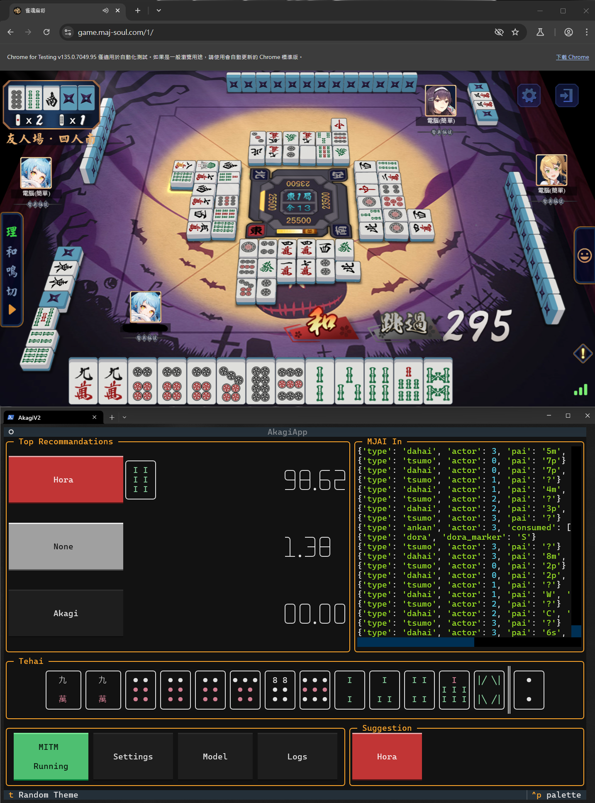
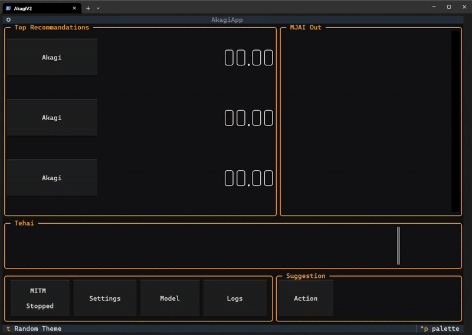
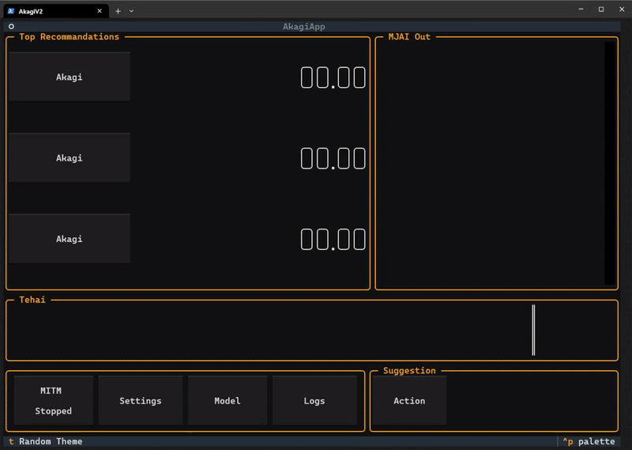

<br/>
<p align="center">
  
  <h1 align="center">Akagi</h1>

  <p align="center">
「死ねば助かるのに………」- 赤木しげる<br>
<br>
    <br/>
    <br/>
    <a href="https://discord.gg/Z2wjXUK8bN">有問題請至 Discord 詢問</a>
    <br/>
    <br/>
    <a href="./README.md">English</a>
    <br/>
    <a href="https://github.com/shinkuan/Akagi/issues">回報錯誤</a>
    .
    <a href="https://github.com/shinkuan/Akagi/issues">功能請求</a>
  </p>
</p>

<p align="center">
  <a href="https://github.com/shinkuan/Akagi"></a>
  <a href="https://github.com/shinkuan/Akagi/releases"></a>
  <a href="https://github.com/shinkuan/Akagi/issues"></a>
  <a href="https://github.com/shinkuan/Akagi"></a>
  <a href="https://discord.gg/Z2wjXUK8bN"></a>
  <a href="https://deepwiki.com/shinkuan/Akagi"></a>
</p>

# 關於

## 「本專案旨在提供一個便利的方式，讓玩家可以即時了解自己在麻將對局中的表現，並藉此學習與進步。此專案僅供教育用途，作者不對使用者利用此專案採取的任何行為負責。若使用者違反遊戲服務條款，遊戲開發者與發行商有權進行處置，包含帳號停權等後果，與作者無關。」



# 功能
- 即時顯示對局資訊
- 即時顯示 AI 評估
- 支援雀魂、天鳳、麻雀一番街、天月
- 支援四人麻將與三人麻將
- 可使用多種 AI 模型
  - 內建模型
  - 線上伺服器模型
  - 自製模型
- 自動化對局
  - *只有在Windows Release版中開啟ot_server時可用
- TUI 介面
  - 支援多種主題

# 目錄

### ⚠️ 仔細閱讀以下內容再開始使用 ⚠️
### ⚠️ 仔細閱讀以下內容再開始使用 ⚠️
### ⚠️ 仔細閱讀以下內容再開始使用 ⚠️

- [關於](#關於)
- [開始前](#開始前)
- [安裝](#安裝)
- [使用方式](#使用方式)
- [常見問題](#常見問題)
- [開發者](#開發者)
- [授權](#授權)

# 開始前

🎥[教學影片連結](https://youtu.be/Z88Ncxbe2nw)

### 你將需要：

1. 一個 `mjai_bot`
   1. 此項目已經包含一個可用的`mortal` mjai bot在[這邊](./mjai_bot/mortal)
      - 由於檔案大小限制，在`./mjai_bot/mortal`下的`mortal.pth`是一個較小的模型
      - 不建議在實際對局中使用
      - 若想取得其他模型，可以從 [Discord](https://discord.gg/Z2wjXUK8bN) 取得
      - 若想取用更強的 AI 模型，也可以使用線上伺服器架設的模型
      - 可從 [Discord](https://discord.gg/Z2wjXUK8bN) 取得 API 金鑰
   2. 或自行製作，請參閱 [開發者](#開發者)
2. 使用 Windows Terminal 開啟 Akagi 才能看到漂亮的 TUI
3. 使用 Proxifier 或類似工具將遊戲流量導向 MITM 埠口

> [!TIP]
> 有些人為Proxifier撰寫了Keygen，你可以透過Google找到它。
>
> 作者對使用者所採取的任何非法行為不負責任。

> [!WARNING]  
> 請使用 Windows Terminal，否則介面顯示將異常

### 支援的麻將遊戲：

| 平台          | 四人麻將       | 三人麻將       | 自動打牌 |
| ------------- | ------------- | -------------- | -------- |
| __雀魂__      | &check;       | &check;        | *&check; |
| __天鳳__      | &check;       | &check;        |  &cross; |
| __麻雀一番街__ | &check;       | &check;        |  &cross; |
| __天月__      | &check;       | &check;        |  &cross; |

*自動打牌僅支援[Windows Release版](https://github.com/shinkuan/Akagi/releases)，且ot_server必須啟用。

# 安裝

- 一般使用者：
  - 前往 [release 頁面](https://github.com/shinkuan/Akagi/releases)
  - 下載最新版
  - 解壓縮 ZIP 檔案
  - 將 MJAI 機器人放到 `./Akagi/mjai_bot`
  - 執行 `run_akagi.exe`
- 開發者：
  - clone 此專案
  - 使用 Python 3.12
  - 安裝相依套件 `pip install -r requirements.txt`
  - 將 MJAI 機器人放到 `./Akagi/mjai_bot`
    - 內建模型：將 `./mjai_bot/mortal/libriichi/libriichi-<version>-<platform>.<extension>` 移動到 `./mjai_bot/mortal/libriichi.<extension>`。
    - 三人模型亦同。
  - 執行 `run_akagi.py`

# 使用方式


1. **檢查設定與 AI 模型**
   1. 選擇模型
      - 點選左下角的「Model」按鈕
      - 從清單中選擇一個模型
      - 若沒有模型，可從 [Discord](https://discord.gg/Z2wjXUK8bN) 取得
      - 內建預設模型為弱 AI
      - __3 人對局請選 3P 模型！__
      - __不要用 4P 模型參與 3 人對局！__
   2. 檢查設定
      - 點選左下角的「Settings」按鈕
      - 檢查設定是否正確
      - 將 MITM 類型設定為你正在玩的遊戲
      - 設定正確的 MITM Host與Port
      - 若不清楚，請保留預設值
      - 預設值: (host: 127.0.0.1) (port: 7880)
      - 若你有取得線上伺服器 API 金鑰，請在設定中輸入
      - 線上伺服器提供更強的 AI 模型
      - 可從 [Discord](https://discord.gg/Z2wjXUK8bN) 取得 API 金鑰
   3. 儲存設定
      - 點選「Save」按鈕
      - 將設定儲存下來
   4. 重新啟動 Akagi
      - 關閉 Akagi 並重新開啟
      - 設定才會套用
   5. 啟動 MITM
      - 點選左下角的「MITM Stopped」按鈕
      - 這會啟動 MITM 代理伺服器

2. **安裝 MITM Proxy 憑證**
   1. 開啟檔案總管（按下 `Windows 鍵 + E`）
   2. 在上方地址欄輸入 `%USERPROFILE%\.mitmproxy` 然後按 Enter
   3. 找到名為 `mitmproxy-ca-cert.cer` 的檔案
   4. 雙擊該檔案
   5. 點選「安裝憑證」按鈕
   6. 若出現選項，請選「本機電腦」，然後點選「下一步」
   7. 選擇「將所有憑證放入下列存放區」，然後點「瀏覽...」
   8. 選「受信任的根憑證授權單位」，按下 OK，再點選「下一步」與「完成」
   9. 若系統要求權限，請點選「是」

3. **Proxifier 設定**
   1. 開啟 Proxifier 並前往「Profile」>「Proxy Servers...」
   2. 點選「Add...」，並輸入以下資訊：
      - 地址: 預設為 127.0.0.1
      - 埠號: 預設為 7880
      - 協定: HTTPS
   3. 點選「OK」儲存代理設定
   4. 前往「Profile」>「Proxification Rules...」
   5. 點選「Add...」新增一條規則
   6. 在「Applications」頁籤點選「Browse...」並選擇遊戲執行檔
      - 以雀魂（Mahjong Soul）Steam 版為例:
        - 到 Steam 資料庫中找到遊戲
        - 點選管理按鈕（齒輪圖示）並選擇「瀏覽本機檔案...」
        - 這會開啟遊戲安裝資料夾
        - 你應該能找到雀魂的執行黨 (`Jantama_MahjongSoul.exe`).
        - 若使用其他平台，請尋找相似的選項
      - 雀魂（Mahjong Soul）網頁版:
        - 遊戲執行檔為 `chrome.exe` 或 `firefox.exe`
        - 注意：這樣會導致所有 Chrome 或 Firefox 流量都經過代理
   7. 「Target Hosts」可維持預設
   8. 「Action」選擇剛新增的代理伺服器
   9. 點選「OK」儲存規則

4. **啟動遊戲用戶端**
5. **加入對局**
6. **檢查 Akagi**
   1. 現在你應該能看到 AI 實時分析對局
   2. 若沒有，請檢查設定與 Proxifier 設定
   3. 或是檢查Logs，看看是否有錯誤訊息
   4. 若有錯誤訊息，可以到 [Discord](https://discord.gg/Z2wjXUK8bN) 尋求協助

## 操作說明

### Akagi

#### 啟動 MITM 代理伺服器：


#### 選擇 AI 模型：
模型儲存在 `./mjai_bot/` 資料夾


#### 變更設定：
> [!IMPORTANT]  
> 重啟後設定才會套用



#### 開啟日誌：
出現問題時可開啟日誌以了解狀況，並附上回報
儲存路徑：`./logs/`


#### 切換 MJAI 資訊視窗內容：
點選該視窗即可切換


#### AutoPlay:
> [!NOTE]
> AutoPlay 僅在 Windows Release 版中啟用，且必須啟動 ot_server。

確保遊戲用戶端的顯示比例設定為 16:9


#### 更換主題：


#### 立直宣告
由於MJAI協議的限制，建議欄為立直時並不會顯示棄牌。
你必須手動點擊立直按鈕來宣告立直。


### Proxifier

> [!NOTE]  
> [Proxifier](https://www.proxifier.com/) 可將指定程式的網路流量導向代理伺服器

#### Proxifier 代理設定範例：


#### Proxifier 規則設定範例：


<!-- Trobleshooting -->
# 常見問題

你可以到[Discord](https://discord.gg/Z2wjXUK8bN)上詢問問題。

> [!TIP]
> 若你有任何問題，請附上日誌檔案，這樣我才能更快地幫助你。
> 日誌檔案位於 `./logs/` 資料夾中。

> [!NOTE]
> 若你在使用過程中遇到任何問題，你可以到Github Issues頁面回報問題。
> 或是到[Discord](https://discord.gg/Z2wjXUK8bN)上詢問問題。

- MITM Proxy 無法啟動
  - 確認是否有其他程式佔用埠口
  - 確認是否有安裝MITM Proxy證書
  - 確認設定的 Host 與 Port 是否正確
  - 確認是否有防火牆阻擋 MITM Proxy
  - 確認你的 Proxifier 設定是否正確
  - 確認MITM Proxy Server是否已經啟動
  - 如果還是無法啟動，請參考[這個Issue](https://github.com/shinkuan/Akagi/issues/57).


# 開發者

## 專案結構

- `./Akagi/` - 專案主要資料夾
  - `akagi/` - Akagi 的 Textual UI
  - `logs/` - 日誌
  - `mitm/` - MITM 代理伺服器
    - `bridge/` - 遊戲用戶端與伺服器的橋接器，用來轉換為 MJAI 協議
      - `majsoul/` - 雀魂橋接器
      - `tenhou/` - 天鳳橋接器
      - `amatsuki/` - 天月橋接器
  - `mjai_bot/` - MJAI 機器人
    - `base/` - 機器人基礎類別，可參考自製機器人
    - `*/` - 各種 bot，例如 `mortal/`
  - `settings/` - 設定檔資料夾
  - `run_akagi.py` - 執行主程式

## 橋接器

要製作一個橋接器，需實作兩部分：

1. `mitm/bridge/mitm_abc.py` 中的 `ClientWebSocketABC`
2. `mitm/bridge/bridge_base.py` 中的 `Bridge`

ClientWebSocketABC 是 mitmproxy 的 addon，功能是將遊戲協議轉為 MJAI 協議並推入 `mjai_messages: queue.Queue[dict] = queue.Queue()`。可參考 `mitm/majsoul/`。

Bridge 為橋接主類別，需實作 `parse()` 方法，將遊戲收到的位元資料解析為 `None | list[dict]`，可參考 `mitm/bridge/amatsuki/bridge.py`。

## MJAI 機器人

要製作 MJAI 機器人，需實作 `mjai_bot/base/bot.py` 中的 `Bot` 類別。

TODO: 製作一個 tsumogiri bot 範例

## TODO

- [x] 支援三人麻將
- [x] 支援 RiichiCity
- [x] 立直後推薦切牌
- [ ] 槓後推薦切牌（極少見）

# 作者

- [Shinkuan](https://github.com/shinkuan/) - shinkuan318@gmail.com
- [Discord](https://discord.gg/Z2wjXUK8bN)


# 授權條款

```
“Commons Clause” License Condition v1.0

The Software is provided to you by the Licensor under the License, as defined below, subject to the following condition.

Without limiting other conditions in the License, the grant of rights under the License will not include, and the License does not grant to you, the right to Sell the Software.

For purposes of the foregoing, “Sell” means practicing any or all of the rights granted to you under the License to provide to third parties, for a fee or other consideration (including without limitation fees for hosting or consulting/ support services related to the Software), a product or service whose value derives, entirely or substantially, from the functionality of the Software. Any license notice or attribution required by the License must also include this Commons Clause License Condition notice.

Software: Akagi

License: GNU Affero General Public License version 3 with Commons Clause

Licensor: shinkuan
```
